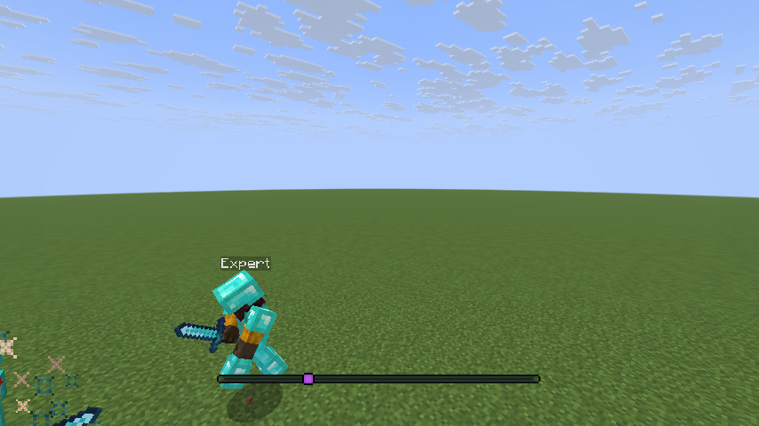
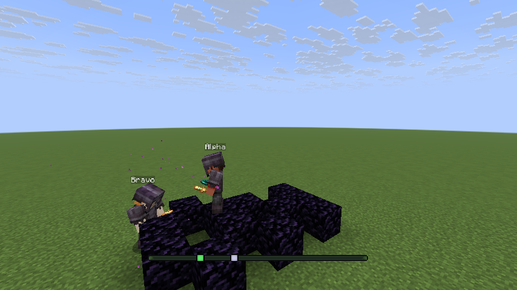
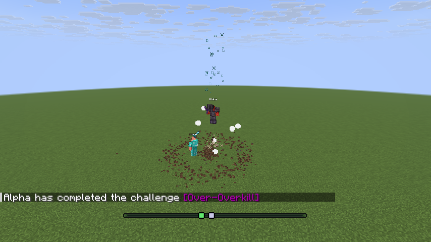
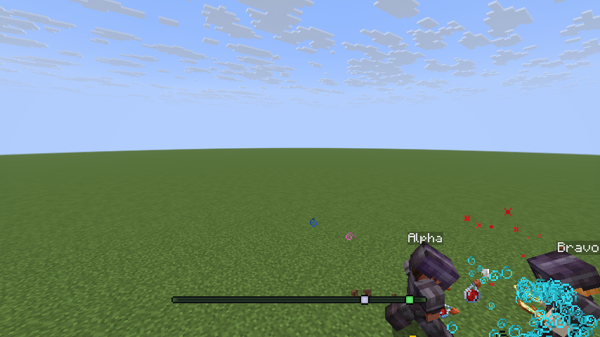
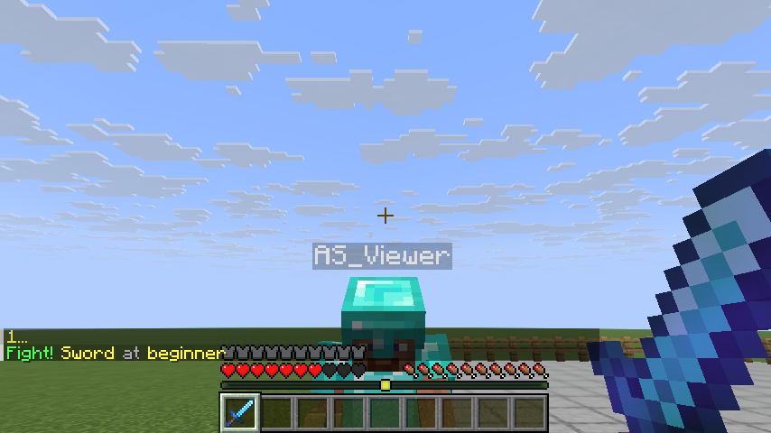
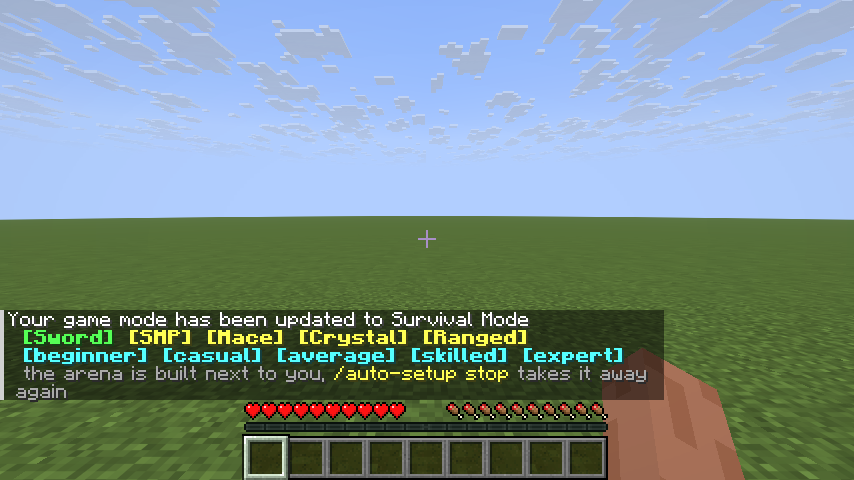
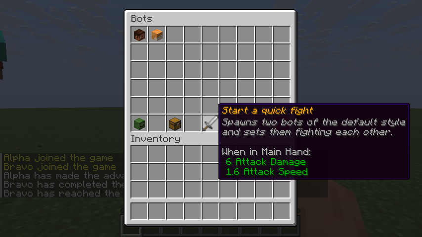
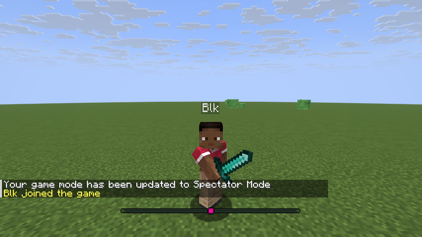

# Carpet PvP


Carpet PvP is a fork of [TheobaldTheBird's Carpet PvP](https://github.com/gnembon/fabric-carpet) and
of Carpet itself. It adds server-side fake players that fight back: bots with six combat styles,
five difficulty levels, human-like aim, navigation through the world, drills and matches for
practice, an in-game menu that vanilla clients can use, and a browser editor for programming a bot's
behaviour. Everything runs on the server; nothing needs a client mod except to *see* sword blocking
and to use the web editor.

Discord: [Carpet PvP Support](https://discord.gg/PAbydjFxKs)
Support this project: [Buy Me a Coffee](https://buymeacoffee.com/andrewyong)

## Supported versions

| Platform | Minecraft | Notes |
|---|---|---|
| Fabric | 1.21.11, 26.2, 26.3 | one jar per Minecraft version, all from the same source tree |
| Fabric | 26.1.2 | use [release 17](https://github.com/AndrewCTF/Carpet-PvP/releases) |
| Paper | see [docs/Paper.md](docs/Paper.md) | a plugin build of the bots is in progress and brings its own page |

Needs [Fabric Loader](https://fabricmc.net/use/installer/) and
[Fabric API](https://modrinth.com/mod/fabric-api). Java 25.

## Installation

1. Download the jar for your Minecraft version from the
   [Releases](https://github.com/AndrewCTF/Carpet-PvP/releases) page.
2. Put it in the server's `mods` folder.

## Quick start

1. Install the mod and start the server.
2. Join and open the menu with `/bot gui`, or type the commands below.
3. Run `/auto-setup sword average`.

What the player sees: `/auto-setup` builds a flat fenced arena twenty blocks east of them, saves
everything they are carrying, gives them a diamond sword and armour and nothing else, and
puts a bot holding the same kit six blocks away facing them. Three seconds later the bot fights. A
round ends when one of you is down, the score is kept, and a menu offers a rematch, an easier or a
harder fight, a different mode, or stopping. `/auto-setup stop` takes the bot away, puts every block
of the arena back and hands the player their own inventory, place and game mode.

Or from the command line:

```
/bot spawn Bot1 sword average
/bot spawn Bot2 sword average
/bot duel Bot1 Bot2
```

## What is in it

### Fighting bots

Six styles, five difficulty levels each. A difficulty sets the bot's reaction time, how deep its
fight planner searches, how often it misses on purpose, and which techniques it will attempt at all.
Every setting is per bot and can be changed while it fights.

| | |
|---|---|
|   | `sword` closes and plans the fight with a rolling-horizon search. `crystal` searches for a place to put a crystal that hurts the opponent and not itself, bridges with obsidian, and sets it off only when the exposure is worth it. `anchor` is the same code allowed to charge respawn anchors. |

| | |
|---|---|
|  | `mace` launches itself with a wind charge, a pearl or an elytra, steers in the air and swings when it has fallen far enough for a smash. It breaks a raised shield with an axe first when the timing fits, and throws a second charge at its own feet when a launch missed so it does not pay for it in fall damage. |

| | |
|---|---|
|  | `smp` is sword fighting with survival on top: it eats, throws splash healing, tops its buffs up, re-totems, swaps a worn piece of armour and drops a cobweb on a target that is running. `ranged` picks the right weapon for the gap — sword inside four blocks, crossbow or bow at range — solves the ballistics for the shot, and keeps its distance between them. |

See [docs/Bots.md](docs/Bots.md).

### One command to a fight



`/auto-setup <mode> [<difficulty>]` builds the arena, saves the player's things to disk, hands out
the kit, spawns the bot and counts down. After every round it offers the next one. Nothing is left
behind: stopping puts the blocks back and gives the inventory, position and game mode back, and the
same happens on logout, on a server stop and after a crash.



Five modes: `sword`, `smp`, `mace`, `crystal`, `ranged`. Each has its own arena.

See [docs/AutoSetup.md](docs/AutoSetup.md).

### A menu that works on a vanilla client



`/bot gui` opens chests: the bots of the server, one page of settings each, the kits, and a kit
editor for building a loadout and saving it under a name of your own. Numbers move in buttons, the
pages repaint when anything changes, and no click can take an item out of the menu.

See [docs/Menus.md](docs/Menus.md).

### Drills and matches

`/bot drill` runs a short exercise against a bot and scores it: hit a strafing bot, axe a shield down
and mace inside the window, re-totem as fast as a bot can pop one, put a crystal under a bot before
it steps off. `/bot match ffa` and `/bot match teams` put bots on a ring around you and let them
fight, with a sixty-second limit and a result line when it ends. `/bot spectate`
puts your camera in a bot's eyes, `/bot skin` puts another account's skin on a bot, and `/bot trace`
prints every click, hit and item use of a bot's last fight.

See [docs/Practice.md](docs/Practice.md).

### Pathfinding and human-like aim

Bots walk: an A* search with a per-bot and a shared node budget, a flow field when several bots chase
the same target, path smoothing, parkour over gaps, ladders, vines, doors and fence gates, and the
option to break, bridge or pillar. They can also fly an elytra on `/player <name> glide ...`.

They do not aim by pointing at you. The view is turned onto the target in whole mouse clicks, at a
maximum rotation per tick, with a reaction time, a Fitts-law movement time and endpoint noise all taken
from the bot's skill, and with a pursuit model that lags behind the target's velocity. The bot sees
its target a few ticks late. A swing is tested against the view the bot actually has, so a swing that
has not finished turning misses. Everything the planner does is drawn from one simulation budget the
bots of the server share, so a busy server costs what it costs and no more.

See [docs/Bots.md](docs/Bots.md#why-a-bot-behaves-like-a-player) and
[docs/FakePlayers.md](docs/FakePlayers.md#navigation).

### CarpetLogic


The same jar serves a browser editor on port 9876 that programs a bot as a graph of nodes: move,
look, use, fight, equip a kit, run a command, branch on a condition, loop, wait for an event. A
program can take a fight over from the combat AI and give it back when it stops. Ten presets ship
with it. Programs are stored in the world folder. A server can turn on an admin sign-in that lets its
operators change rules from the editor's Settings panel.

See [docs/CarpetLogic.md](docs/CarpetLogic.md).

### Kits

`/bot kit give`, `save`, `delete`, `restore` and `reload`, with six built-in loadouts — one per style
plus an axe kit — and one file per custom kit in `<world>/carpet-kits/`. A kit is a list of items with
slots and enchantments, or the finished stacks with their data components, so a written book or a
named sword survives the trip.

See [docs/Kits.md](docs/Kits.md).

### 1.8-style sword blocking



`swordBlockHitting` makes right-clicking with a sword raise a block: damage and knockback taken
during the window are reduced, and clients with the mod draw the pose. `spamClickCombat` removes the
attack cooldown, `shieldStunning` lets damage through straight after a shield is disabled, and seven
`damageTick*` rules tune the invulnerability window per weapon.

See [docs/SwordBlocking.md](docs/SwordBlocking.md).

### Carpet's rules and Scarpet

Everything upstream Carpet does is still here: `/carpet` rules for hundreds of gameplay and
creativity changes, the fake-player `/player` command with its action pack, and Scarpet, the in-game
scripting language, with `/script`, world apps, the app store and its event system. This fork adds
rules of its own on top; see [docs/Rules.md](docs/Rules.md).

## How it compares

The other columns are as listed by each project in October 2026. Nothing here is a claim about
quality, only about what each one says it does.

| | Carpet PvP | HeroBot | PvP BOT | VexBot | MaceBot | SMP PvP Bots | Leaves fake players |
|---|---|---|---|---|---|---|---|
| Minecraft versions | 1.21.11, 26.2, 26.3 | 1.21.11 | 1.21.10–1.21.11 | 1.21.11, 26.1.2, 26.2 | 1.21–26.2 | 26.1–26.3 | 1.21.11 |
| Platform | Fabric (Paper in progress) | Fabric | Fabric, needs HeroBot | Fabric | Fabric | datapack | Fabric |
| One-command setup | `/auto-setup` | | | | | | |
| Modes | sword, smp, mace, crystal, anchor, ranged | framework for datapack authors | sword, axe, bow, mace with wind charges, crystal, anchor, spear | wide weapon list including TNT minecart, trident and elytra mace | mace only | four kits | no combat AI |
| Difficulty levels | 5 | | | | 3 | 3 | |
| Human-like aim | perception delay, mouse-step view, click rate, shared sim budget | ping simulation | | POV recording | | | |
| Visual programming | CarpetLogic, a node graph in the browser | | | | kit editor | | |
| Menu for vanilla clients | `/bot gui` | | web stats page | | kit editor | | |
| Drills and matches | 5 drills, FFA and team matches | | | | drills | | |
| Paper support | in progress | | | | | | |
| Tested by an automated suite | 107 self-test scenarios on three Minecraft versions | | | | | | |

## Documentation

| Page | What is on it |
|---|---|
| [docs/Bots.md](docs/Bots.md) | the six combat styles, the five difficulty presets, every bot setting, duels and statistics |
| [docs/AutoSetup.md](docs/AutoSetup.md) | `/auto-setup`: the arenas, the rounds, what is saved and restored |
| [docs/Menus.md](docs/Menus.md) | `/bot gui`: every page, the kit editor, saving under a name |
| [docs/Practice.md](docs/Practice.md) | drills, matches, spectating, skins, traces and factions |
| [docs/Commands.md](docs/Commands.md) | every command the mod registers, one line each |
| [docs/Rules.md](docs/Rules.md) | every rule this fork adds, with defaults and values |
| [docs/FakePlayers.md](docs/FakePlayers.md) | `/player` in full: spawning, actions, navigation, gliding, the combat AI, factions |
| [docs/Kits.md](docs/Kits.md) | `/bot kit`, the kit file format and the built-in kits |
| [docs/CarpetLogic.md](docs/CarpetLogic.md) | the browser editor: nodes, presets, the HTTP API and its security model |
| [docs/SwordBlocking.md](docs/SwordBlocking.md) | `swordBlockHitting` and 1.8-style combat |
| [docs/SelfTest.md](docs/SelfTest.md) | all 107 self-test scenarios, what each proves, and how to add one |
| [docs/Building.md](docs/Building.md) | building one source tree for three Minecraft versions |
| [docs/Paper.md](docs/Paper.md) | the Paper plugin build |
| [docs/scarpet](docs/scarpet/Documentation.md) | the Scarpet language |

## Building and testing

```
./gradlew build                    # compiles all three Minecraft versions and runs the unit tests
./gradlew build runSelfTest        # and boots a server per version to run the 107 scenarios
./gradlew :26.3:runSelfTest -PselfTest=spawn,nav_goto   # chosen scenarios, one version
```

Always build every version in one invocation so all the cores are used. Reports land in
`run/selftest-<version>/selftest-report.json`.

See [docs/Building.md](docs/Building.md) and [docs/SelfTest.md](docs/SelfTest.md).

## Contributing

Contributions are welcome. Read [docs/Building.md](docs/Building.md) first: the source tree is shared
between three Minecraft versions and the differences live in Stonecutter comments. Self-test
scenarios go in a new file per feature under `carpet.pvp.selftest`, registered in `ScenarioIndex.java`,
not in `SelfTest.java`.

## Star History

[]()