# CarpetLogic

CarpetLogic is the bot programming layer. You build a program as a graph of nodes in a web editor
in your browser; the editor compiles it to a tree of actions; the server walks that tree on a fake
player, one step per tick.

Two things are independent of each other:

- **The programs.** They live in the world folder, you run them with `/carpetlogic programs run`,
  and they work whether or not the web server is running.
- **The web editor.** An HTTP server that serves a page, hands out the schema and takes programs
  back. Purely optional.

## The editor

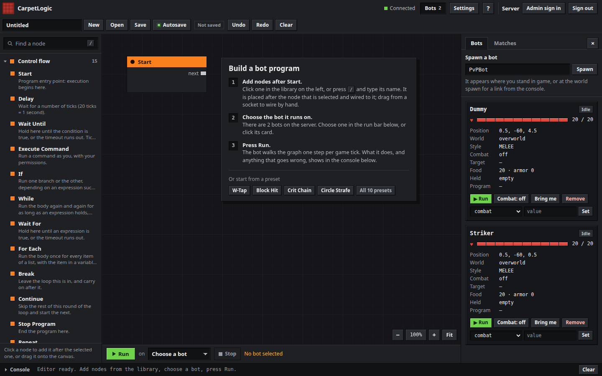

The page is one screen:

- **The node library** on the left lists every node under its category. Type in *Find a node*, or
  press `/` anywhere, to search all of them by name, by category and by what they do; `Enter` adds the
  first match. A node that is clicked goes after the node that is selected and is wired to it, so
  clicking one after the other builds a chain from `Start`; a condition goes under the node that is
  waiting for one. Dragging a node onto the canvas places it without wiring it.
- **The canvas** in the middle is the program. While it holds nothing but `Start` it shows what to do
  next and offers the first presets. Drag the background to pan, scroll to zoom, `F` or **Fit** to
  bring the whole program into view.
- **A node's settings** open over the canvas's top right corner when one node is selected: every
  parameter as a field, with what it takes and, for an [expression](#expressions), the names it can
  use and what is wrong with it. The small fields on the node itself still work for a quick change.
- **The run bar** under the canvas runs the program on the bot chosen there and stops it, and says
  what that bot's program is doing: `Running · Patrol and Fight · PATROL`, or the error that ended it.
- **The bots panel** on the right (`B`) spawns a bot and has a card for each one: health in hearts,
  position, what it holds and fights, its program, and buttons to run on it, turn its combat AI on or
  off, bring it to you, remove it, and set one combat option. **Matches** lists the finished fights.
- **The console** at the bottom keeps what programs log and what went wrong. Shut, it shows the last
  line; an error opens it.
- **The top bar** holds the program (name, New, Open, Save, the Autosave switch, Undo, Redo, Clear),
  the connection, **Settings** and who the session belongs to, with **Sign out**. Beside **Save** it
  says where the program stands; see [Saving](#saving).

| | |
|---|---|
| 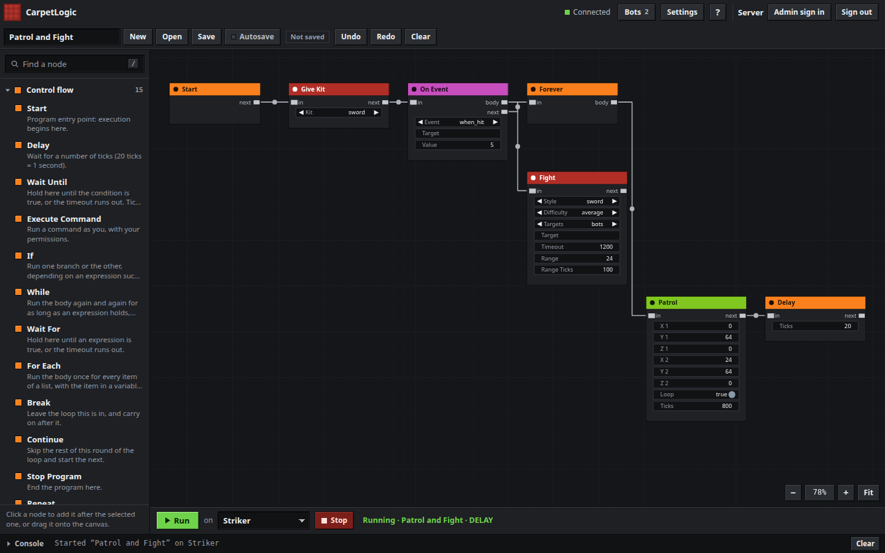 | 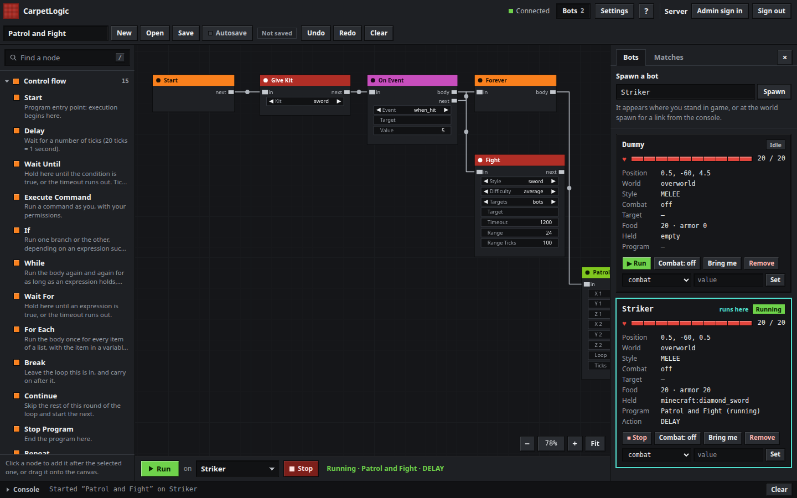 |
| 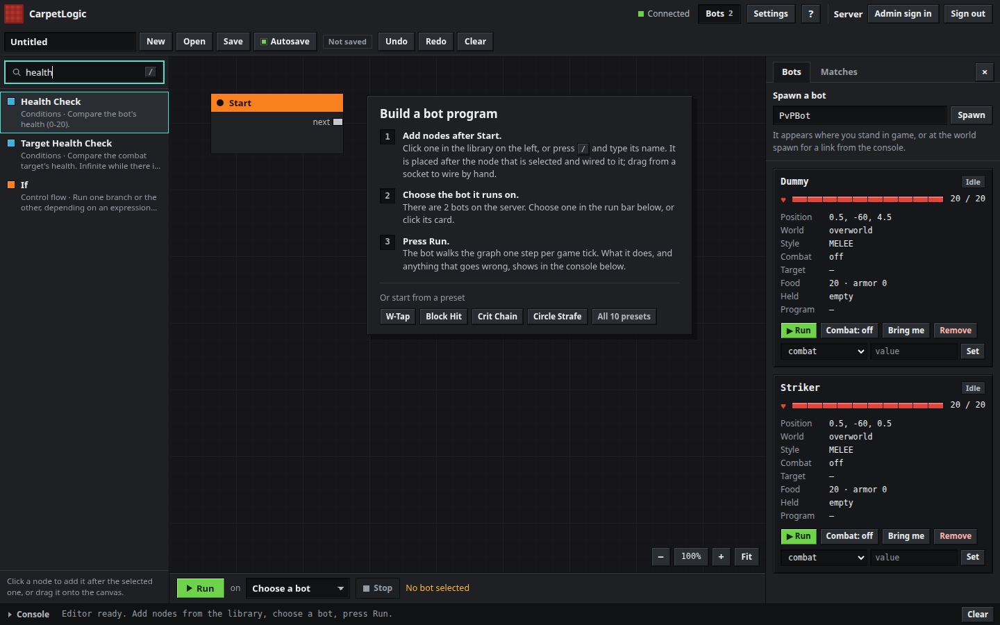 | 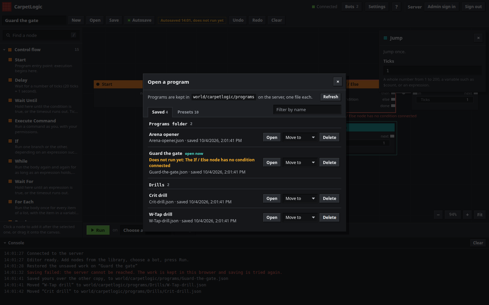 |

`?` in the top bar lists the keyboard shortcuts: `Ctrl+Enter` runs, `Ctrl+.` stops, `Ctrl+S`, `Ctrl+O`
and `Ctrl+N` save, open and start a program, `Ctrl+Z` and `Ctrl+Y` undo and redo.

In a window too narrow for all of it the bots panel lies over the canvas instead of beside it, and
below 820 pixels the library does too and is called with **Nodes** or `/`.

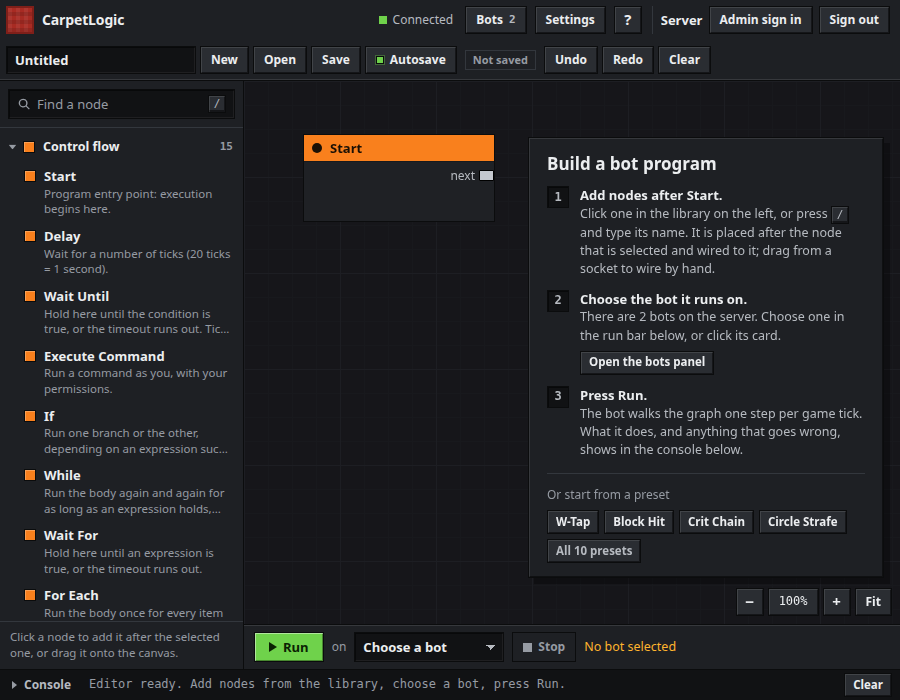

A page that has lost the server says so in a bar under the top bar and keeps trying; one whose
session has ended, or that never had one, shows how to get in instead of an editor that does nothing.

## Saving

A program is a file in a folder on the server, and the editor puts it there by itself.

**Where.** `<world>/carpetlogic/programs/`, one file per program, named after the program:
`Patrol and Fight` is `Patrol-and-Fight.json`. The Open dialog shows the folder's path as it is on the
server, and after a save the console and the toolbar's tooltip say which file the program went to.
See [How they are stored](#how-they-are-stored) for how a name becomes a file name.

**Save always saves.** A program that does not compile yet, say an If / Else with nothing wired to
its condition, is saved as a *draft*: the file holds the graph and the reason, the toolbar and the
Open dialog say `does not run yet` with that reason, and Run and `/carpetlogic programs run` refuse it
with the same words. Nothing is lost by closing the tab on unfinished work.

**Autosave.** With the switch on, which it is until somebody turns it off, the open program is saved

- two seconds after the last change,
- before Run, so what runs is what is saved,
- when the page is hidden or left, and before another program is opened.

A new program is saved as soon as it has a first node or a name. The server gives a program without
a name one, `Untitled`, then `Untitled 2`, and keeps names apart: a second `Walk` becomes `Walk 2`,
and the page takes the name the server answers with. A save that changes nothing writes nothing, and
one session may write sixty times a minute. The switch is remembered in the browser. With it off,
only **Save** and `Ctrl+S` save, and leaving the page with unsaved work asks first.

| The toolbar says | When |
|---|---|
| 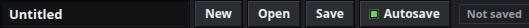 | nothing on the canvas yet |
| 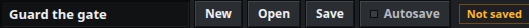 | there is work the server does not have, and autosave is off |
|  | a save is on its way |
|  | the server has the program as it is on the canvas |
|  | the same, saved without being asked |
| 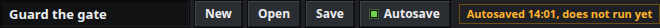 | saved as a draft; the tooltip has the reason |
| 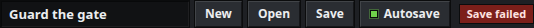 | the server refused, with the reason in the tooltip and the console; it is tried again after 5 seconds, then 10, 20, 40, and every minute from there |
| 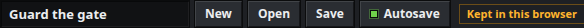 | the server cannot be reached; it is saved as soon as it answers |

**Nothing is dropped.** Every change the server does not have yet is also kept in the browser. If the
tab is closed before the server has it, because the server was away, the save failed or the
program was too large to send while the page closed, the next visit offers it back:


In viewer mode the server takes no writes, so the editor sends none: the toolbar says so and the work
stays in the browser.

**Two tabs.** Each save says which copy it started from, by the `updatedAt` of the file. A save from
an older copy is refused, nothing is overwritten, and the page asks which copy stays:

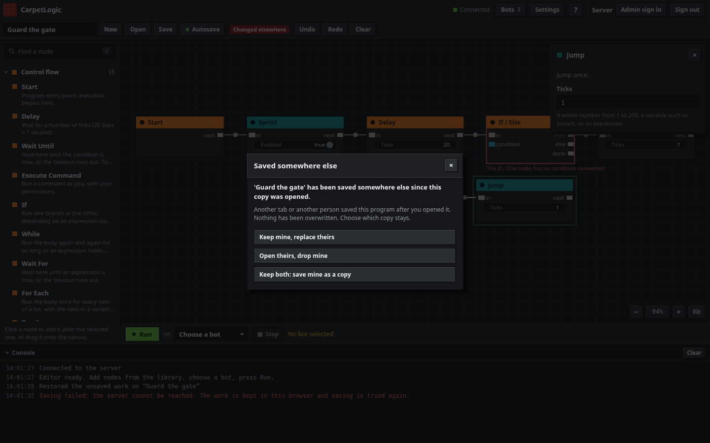

**Folders.** A program can be moved into a subfolder of the programs folder from the Open dialog,
one level deep, and back. A file put into the folder by hand, or a subfolder made there, shows up the
next time the dialog is opened or **Refresh** is pressed; no restart is needed.

## The command

```
/carpetlogic                       same as /carpetlogic status
/carpetlogic status                web server URL, bot count, running programs, saved programs
/carpetlogic open                  a link to the web editor, with a token
/carpetlogic password              a link that sets your admin password for the web editor
/carpetlogic password <player>     the same for another admin; console only
/carpetlogic programs              the programs folder, the saved programs and which are drafts
/carpetlogic programs run <program> <bot>
/carpetlogic programs stop <bot>
/carpetlogic bots                  list active bots with health and position
```

The whole command is behind the `commandCarpetLogic` rule, which is `"ops"` by default.

`/carpetlogic open` only hands a link to the entity it should:

- a real player gets the link in their own chat, never in the sender's console output. An
  `/execute as <player> run carpetlogic open` therefore does not leak the token to whoever typed it.
- the server console gets the link when it is op level 4.
- anything else is refused: "Only a player or the server console can open the web editor".

If the web server is not running the command says so, and the reason is in the server log. That
happens when the port is taken, or when the Java runtime has no `jdk.httpserver` module.

`/carpetlogic password` belongs to [the admin sign-in](#the-admin-sign-in) and is refused while
`carpetLogicAdminLogin` is off. It never takes a password: it answers with a link to the page where
one is set.

- a player who may change Carpet rules gets the link in their own chat, as with `open`.
- the console names the admin, `carpetlogic password Steve`, and is told the link to pass on. The
  admin does not have to be online, but has to be one: "Steve may not change Carpet rules, so cannot
  be an editor admin. Op them first".
- a player who names somebody else is refused: "Only the server console can make a password link for
  somebody else".

## Security

### The bind address

`carpetLogicBindAddress` is `127.0.0.1` by default, so the editor is reachable only from the
machine the server runs on. Setting it to `0.0.0.0` listens on every interface. Those two are what the
rule suggests; it will accept any address the machine can resolve.

The bind address and port are read when the server starts, so changing them needs a restart. The
`-Dcarpet.logicPort=<n>` system property overrides `carpetLogicPort` and nothing else, which is how
the self-test asks the operating system for a free port; `0` means "any free port".

`carpetLogicPort` is 9876 by default. If something else already has that port, the server logs
`CarpetLogic web editor could not listen on 127.0.0.1:9876` and the web editor stays down:
`/carpetlogic open` says "The web editor is not running; the server log says why", and
`/carpetlogic status` reports `Web editor: not running`. Everything else keeps working — program
storage, the bot manager and the executor are separate from the HTTP server, so
`/carpetlogic programs run` is unaffected.

### Tokens

A token is the only credential the API accepts.

- `/carpetlogic open` mints one: 32 random bytes, base64url, no padding. The admin sign-in, where a
  server has turned it on, mints the same kind of token for a name and password.
- The link carries it in the fragment: `http://127.0.0.1:9876/#token=...`. The page reads it on
  load, keeps it in `sessionStorage` for that tab and takes it out of the address bar, so it is not
  sent to the server on any static request.
- Every `/api/` request carries it as `Authorization: Bearer <token>`. Static files are public:
  there is nothing in them but the editor.
- Sessions live in memory only. A server restart invalidates every token.
- The server stores the SHA-256 of the token, not the token itself.
- A token expires after `carpetLogicSessionHours` (24 by default). Expired tokens are dropped when
  they are next used or when a new one is issued.
- At most 4 live sessions per owner; issuing a fifth drops that owner's oldest.
- **Sign out** in the editor ends the session on the server (`POST /api/logout`) and forgets the
  token in the page.
- A page opened without a token, or with one that has run out, has no editor to show and says how to
  get a link:

  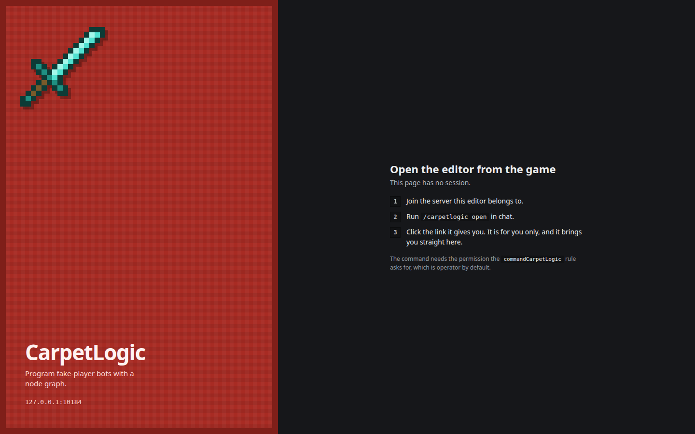

- There is no cookie. The only password is the one of the admin sign-in below, which a server does
  not have unless it turns `carpetLogicAdminLogin` on.

### The admin sign-in

A link from `/carpetlogic open` lets its player build and run programs. It does not let anybody
change the server's rules: the Settings panel shows them read only. `carpetLogicAdminLogin`, off by
default, adds a way for the server's admins to sign in to the editor and change rules there.

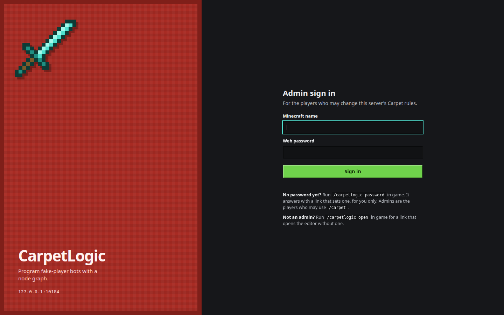

**Who is an admin.** Whoever `/carpet <rule> <value>` would obey: a player whose operator level
passes `carpetCommandPermissionLevel`. The level is read from the server's operator list, so it holds
for an admin who is not in the game, and it is read again on every request an admin session makes: a
player who is deopped has lost the editor's settings at the next click.

**The password.** An admin has a web password that is separate from everything else and is never
typed in chat or at the console.

1. The admin runs `/carpetlogic password` in game, or the console runs `carpetlogic password <player>`.
2. The answer is a link, `http://127.0.0.1:9876/#setup=<ticket>&name=Steve`. The ticket is 32 random
   bytes, works once, lasts 10 minutes and is for that one account; asking again makes the earlier
   link worthless. Like a token it travels in the fragment and is taken out of the address bar.
3. The page the link opens asks for the new password twice and sends it with the ticket
   (`POST /api/password`). A password has 10 to 128 characters.
4. The server keeps a salted hash and nothing else: PBKDF2-HMAC-SHA256 with 600,000 rounds, the
   figure OWASP gives for it, and 16 random bytes of salt per account, in
   `<world>/carpetlogic/admins.json`. The file is written beside itself and moved into place, so a
   crash cannot leave half of one, and is readable by the server's user only where the file system
   knows about owners. Neither a password nor a hash is ever logged.
5. Setting a password signs out the sessions the old one had opened.

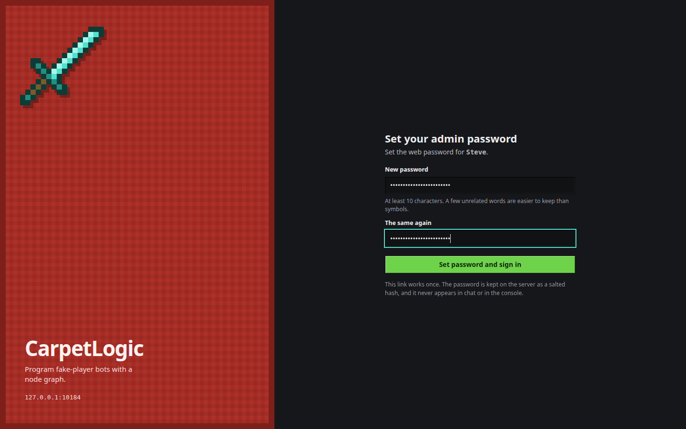

**Signing in.** The page of a visitor without a token shows the sign-in instead of the note about
`/carpetlogic open`, and an editor opened from a link has **Admin sign in** in its top bar. Name and
password go to `POST /api/login`; the answer is a token like any other, marked as an admin's, kept in
`sessionStorage` and valid for `carpetLogicSessionHours`.

- Every failure gets the same answer, `401 Wrong name or password`: a name nobody has, a name
  without a password, a wrong password, and an account that is no longer an admin. Every one of them
  costs the server the same work, one hash and one look at the operator list, so the time an answer
  takes says nothing either.
- Guessing is slowed down. A name gets 5 attempts; after that each further one has to wait, 5
  seconds at first and twice as long every time, up to 15 minutes, wherever the attempts come from.
  An address gets 20 before the same happens to it. A record is forgotten an hour after its last
  attempt, signing in clears it, and the table holds 4096 names and addresses and takes no new one
  when it is full. The answer while waiting is `429` with a `Retry-After` header.
- At most two passwords are hashed at once, so a flood of attempts cannot take the processor from
  the game.
- The two routes only take `application/json`, which a page on another site cannot send without the
  browser asking first, and nothing is answered with CORS headers.

**What signing in unlocks.** The Settings panel becomes editable:

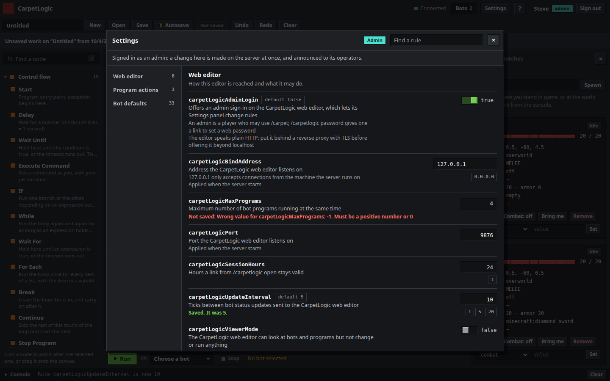

It lists the rules the editor lives by, the rules some nodes need, and the defaults of the bots'
combat AI, straight from the rule registry: name, description, type, the values it suggests and the
one it has. A rule that is on or off is a switch, one of a fixed set a list, anything else a field
with its suggested values under it. A change is made at once through the same code path as `/carpet
<rule> <value>`, so the rule's validators decide and its observers hear of it, and the row says
`Saved` or `Not saved:` with the validator's own reason. The change is written to the server log with
the admin's name and announced to the operators the way `/carpet` announces one. If the settings are
locked in `carpet.conf` the panel is read only for admins too and says why.

Without an admin session the same panel is read only:

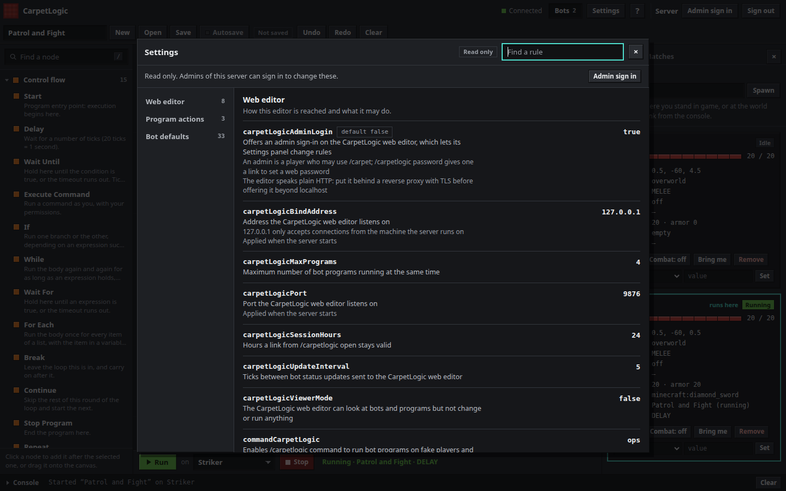

Viewer mode does not lock an admin out of the settings: `POST /api/settings` is the one change an
admin session can still make while `carpetLogicViewerMode` is on, which is how it is turned off
again. Turning `carpetLogicAdminLogin` itself off from the panel asks first, because it ends the
session that does it.

**What this protects, and what it does not.**

- The editor speaks plain HTTP. Without TLS, anybody who can read the traffic between the browser
  and the server reads the password as it is typed in and every session token after it. On the
  default bind address that traffic never leaves the machine. **A server that offers the editor
  beyond localhost should put it behind a reverse proxy that speaks HTTPS**, and leave
  `carpetLogicBindAddress` at `127.0.0.1` so that the proxy is the only way in. The sign-in page says
  so itself when it was loaded over plain HTTP from another machine.
- Behind such a proxy every visitor arrives from the proxy's address. The server does not trust a
  forwarded-for header, so the 20 attempts of an address are then shared by everybody; the limit per
  name is what holds. Rate limiting by the visitor's real address belongs in the proxy.
- Somebody who knows an admin's name can keep its sign-in waiting by guessing at it. They get no
  closer to the password, and the admin loses nothing in game, where rules are changed with
  `/carpet` as before.
- An admin session is a session of that player. A program it runs with an `EXECUTE_COMMAND` node
  runs the command as the player, with the player's permissions, while the player is online. A web
  password is therefore worth as much as the account's operator rights.
- A link the console asked for is in the server log, as everything the console is told is. It is
  worthless once used, and after ten minutes.
- The hash protects the password of somebody who used it elsewhere, should the file be read; it does
  not protect the server, whose files the reader already has.
- With the rule off none of this exists: the two routes answer like any other path without a token,
  admin sessions are gone, and the password file is not read by anything.

### What a token can do

Every token is only as good as its owner:

- A token minted for a player is tied to that player's UUID. If the player logs out, every API
  request with that token is refused with 403 "The player this link was issued to is not online",
  and any open event stream is closed.
- The player must still be allowed to use `/carpetlogic`. Losing op mid-session takes the token's
  permissions away: 403 "The player this link was issued to may no longer use /carpetlogic".
- A token minted from the console has no owner. It is not tied to any player, so it keeps working
  when nobody is online.
- A token from the admin sign-in is tied to the admin's UUID too, but not to their being online: it
  works while the account may change Carpet rules, and gets 403 "This account may no longer change
  Carpet rules" once it may not. It is the only kind of token `POST /api/settings` accepts.
- Viewer mode (`carpetLogicViewerMode`) turns every non-`GET` request into 403, whatever the token,
  except an admin's `POST /api/settings`.

What a token cannot do, with any token:

- Nothing outside `/api/`, and no path traversal in the static handler.
- Not more than 16 concurrent event streams.
- Not more than a 2 MiB request body.
- Not more than 5 seconds of server-thread time per request.

### Owner permissions and `EXECUTE_COMMAND`

Actions are driven through the fake player's action pack, so they carry no permissions of their
own. `EXECUTE_COMMAND` is the exception, and it is the one place a program can do something the bot
itself would not be allowed to do.

- A command in a program runs **as the player whose editor started it**, with that player's
  permissions. It never runs as the console, and never as the bot.
- If that player is offline when the command comes up, the program fails with
  "EXECUTE_COMMAND needs the player who started this program to be online".
- A program started from `/carpetlogic programs run` or from the console has no owner, so
  `EXECUTE_COMMAND` always fails there with
  "EXECUTE_COMMAND only runs in programs a player started from the web editor".

There is a second, quieter permission path. When an action's schema entry declares `requires`, the
executor checks that carpet rule before running the action. If the rule is off it tries to turn it
on, as the owner — but only when the owner is online, the settings are not locked from `.conf`, and
the owner passes `carpetCommandPermissionLevel`. If it turns it on, the owner is told
"Your bot program turned on the carpet rule X". If it cannot, the program stops with
"The carpet rule 'X' is off. Turn it on with /carpet X true".

So a player who can run programs from the editor can, indirectly, flip the rules their own programs
need — but only ones they were already allowed to flip.

## Rules

Everything CarpetLogic is configured with is an ordinary carpet rule. Change one with
`/carpet <rule> <value>`.

| Rule | Type | Default | What it does |
|---|---|---|---|
| `commandCarpetLogic` | string permission | `ops` | Whether and for whom `/carpetlogic` works at all. Also the permission a token's owner is re-checked against. |
| `carpetLogicPort` | int 1–65535 | `9876` | Port the web editor listens on. Applied at server start. |
| `carpetLogicBindAddress` | `127.0.0.1`, `0.0.0.0` | `127.0.0.1` | Interface the web editor listens on. Applied at server start. |
| `carpetLogicSessionHours` | int | `24` | How long a link from `/carpetlogic open` stays valid. |
| `carpetLogicUpdateInterval` | int 1–1024 | `5` | Ticks between bot status pushes on the event stream. |
| `carpetLogicViewerMode` | boolean | `false` | The editor can look at bots and programs but not change or run anything. Refuses every non-`GET` API call, except an admin changing a setting. |
| `carpetLogicAdminLogin` | boolean | `false` | Offers the admin sign-in, which lets the Settings panel change rules. See [The admin sign-in](#the-admin-sign-in). |
| `carpetLogicMaxPrograms` | int | `4` | How many programs may run at the same time. |

Three more rules decide whether particular actions work:

| Rule | Default | Affects |
|---|---|---|
| `fakePlayerNavigation` | `true` | `NAV_GOTO`, `FOLLOW_PLAYER`, `CHASE_PLAYER`, `PATROL`, `FLEE_FROM`, `WANDER` |
| `fakePlayerElytraGlide` | `false` | `GLIDE_START`, `GLIDE_GOTO`, `GLIDE_HEADING`, `GLIDE_SPEED`, `GLIDE_FREEZE`, `GLIDE_LAND` |
| `swordBlockHitting` | `false` | `SWORD_BLOCK` |

The combat nodes need none of them: turning the combat AI on and off is part of running a program, the same
as the kit and option commands, which are behind `commandBot` rather than behind a rule.

## Programs

### How they are stored

One JSON file per program, named after it, in the programs folder or in a subfolder one level down:

```
<world>/carpetlogic/programs/<name>.json
<world>/carpetlogic/programs/<folder>/<name>.json
```

| Field | Meaning |
|---|---|
| `id` | 1–64 characters of letters, digits, `_` and `-`. It is what the editor and the API know the program by, and it stays the same when the program is renamed or moved. |
| `name` | the display name, up to 64 characters |
| `description` | free text |
| `actions` | the compiled action tree; empty for a draft |
| `error` | why the graph does not compile, for a draft; absent for a program that runs |
| `graphData` | the editor's node graph, so reopening the program shows the same picture. Members that are `null` are not kept. |
| `createdAt`, `updatedAt` | epoch milliseconds. `updatedAt` is what a stale save is told by. |
| `isPreset` | never true in a saved file |

**The file name** is the program's name with every run of characters other than letters, digits, `_`
and `-` turned into one `-`, cut at 64 characters: no separator, no dot, nothing that could leave the
folder. A name with nothing left is `program`; a name Windows keeps for a device (`CON`, `NUL`, …)
gets `-program` after it. **Renaming the program renames the file**, in the same save. The other
choice, a file name fixed at the first save, would leave most programs in a file called `Untitled`,
because autosave makes the first save before a name has been typed; the file a person looks for
should carry the name the editor shows. What stays stable is the `id` inside the file.

No two programs share a file name, in any folder and whatever the case, and none takes a preset's id:
a name that would is given the first free number, `Walk 2`. So a name finds one program, and
`/carpetlogic programs run Walk <bot>` needs no folder. Where files made by hand break this, the
command takes the program in the programs folder itself before one in a subfolder, and `Drills/Walk`
names the one in `Drills`.

**Programs saved before** as `<id>.json` keep loading, by the id inside them, and move to a file
named after them the next time they are saved.

**Files made by hand.** The folder is read when the server starts, on `/carpet reload`, and every time
the editor lists the programs. A file without an `id` is given one from where it is,
`file-<folder>-<name>`, the same one every time. A copy of another program's file carries that
program's id; the file a save would have written keeps it and the copy gets one from where it is. A
file whose name is missing is named after the file.

**What does not stop the folder being read:** a draft; a file whose actions do not fit this server's
schema, which is listed as a draft with that reason so that it can be opened and put right, and is
not rewritten; a file that is not JSON, is larger than 4 MiB or carries an invalid id or a preset's,
which is skipped with a warning in the log. At most 2000 files are read.

The built-in presets live in the mod jar instead (`/carpetlogic/presets.json`) and are listed
separately; a program may not be saved over a preset's id.

### The compiled action tree

```json
{
  "type": "MOVE",
  "params": { "direction": "forward", "ticks": 20 },
  "children": [],
  "elseChildren": [],
  "condition": null,
  "conditions": []
}
```

`type` names an action from the schema. `params` holds its parameters. The other four fields exist
only for the action types whose schema entry lists the matching slot; `conditions` is what a
condition that combines others is made of.

A program is validated before it runs and before it is saved: known types, only declared
parameters with values of the right type, children and conditions only where the type has a slot
for them, no more than 64 levels of nesting, no more than 10 000 actions, and no string parameter
longer than 1024 characters.

### Statuses

| Status | Meaning |
|---|---|
| `RUNNING` | still going |
| `COMPLETED` | reached the end of the tree |
| `ERROR` | something went wrong; the bot was stopped and the reason is in `error` |

A program whose bot disappears stops and says so. Starting a program on a bot that already has one
replaces it. At most `carpetLogicMaxPrograms` run at once.

## Node types

**`src/main/resources/carpetlogic/actions.json` is the source of truth.** The interpreter reads every
parameter through that file, and the web editor is sent the very same file to build its node widgets
and compile graphs against it. If this page and that file ever disagree, the file is right.

It has three sections:

```json
{
  "_comment": "...",
  "variables": {
    "referencePrefix": "$",
    "namePattern": "^[A-Za-z_][A-Za-z0-9_]*$",
    "maxVariables": 64
  },
  "actions": { "MOVE": { "kind": "action", "node": "Movement/Move", "params": [ ... ] } }
}
```

`_comment` is prose for whoever is editing the file. Each action has:

| Field | Meaning |
|---|---|
| `kind` | `action` (a step), `control` (holds other actions in the listed slots) or `condition` (only tested by `IF_THEN_ELSE` and `WAIT_UNTIL`) |
| `node` | the editor node this action is compiled from, `Category/NodeName` |
| `slots` | which of `children`, `elseChildren` and `condition` this type may carry |
| `params` | the parameters it takes |
| `requires` | the carpet rule that must be on for the action to work, or absent |
| `drivesBody` | the action moves the bot or clicks for it; see [Who drives the bot](#who-drives-the-bot) |

Each parameter has a `name`, a `type` (`int`, `number`, `bool`, `string`), a `default`, and
optionally `min`/`max` or the `options` it may take. A missing parameter falls back to its default,
and a number outside `min`/`max` is clamped. A parameter may also carry an `optionsFrom` instead of an
`options` list, naming a list that is generated from the running server rather than written down, so a
style or a preset added to the bot appears in CarpetLogic without anyone editing this file:

| `optionsFrom` | What it holds |
|---|---|
| `combatStyles` | every `BotPvpConfig.CombatStyle`, by the name `/bot spawn` takes: `sword`, `crystal`, `anchor`, `ranged`, `mace`, `smp` |
| `difficulties` | the five `BotPvpConfig.Difficulty` presets, `beginner` to `expert` |

`GET /api/schema` is sent the file with every `optionsFrom` resolved into an `options` array in place,
so the editor builds its dropdowns from the very same values the interpreter checks a parameter
against. `combatStyles` and `difficulties` are read by name wherever a node wants them.

The 72 nodes, in full:

### Movement

| Node | Type | Kind | Rule it needs | Parameters |
|---|---|---|---|---|
| `Movement/Move` | `MOVE` | action |  | `direction` string = `forward` (`forward`, `backward`, `left`, `right`); `ticks` int = `20`, min `1`, max `6000` |
| `Movement/Strafe` | `STRAFE` | action |  | `direction` string = `left` (`left`, `right`); `ticks` int = `10`, min `1`, max `6000` |
| `Movement/Sprint` | `SPRINT` | action |  | `enabled` bool = `true`; `ticks` int = `0`, min `0`, max `6000` |
| `Movement/Sneak` | `SNEAK` | action |  | `enabled` bool = `true`; `ticks` int = `0`, min `0`, max `6000` |
| `Movement/Jump` | `JUMP` | action |  | `ticks` int = `1`, min `1`, max `200` |
| `Movement/Mount` | `MOUNT` | action |  | `onlyRideables` bool = `true` |
| `Movement/Dismount` | `DISMOUNT` | action |  | none |
| `Movement/StopMovement` | `STOP_MOVEMENT` | action |  | none |

### Combat

| Node | Type | Kind | Rule it needs | Parameters |
|---|---|---|---|---|
| `Combat/Attack` | `ATTACK` | action |  | `mode` string = `once` (`once`, `continuous`, `interval`); `interval` int = `10`, min `1`, max `200`; `ticks` int = `1`, min `1`, max `6000` |
| `Combat/CritAttack` | `ATTACK_CRIT` | action |  | `ticks` int = `15`, min `10`, max `100` |
| `Combat/SwordBlock` | `SWORD_BLOCK` | action | `swordBlockHitting` | `ticks` int = `40`, min `1`, max `6000` |
| `Combat/ShieldBlock` | `SHIELD_BLOCK` | action |  | `ticks` int = `40`, min `1`, max `6000` |
| `Combat/UseItem` | `USE` | action |  | `mode` string = `once` (`once`, `continuous`, `interval`); `interval` int = `10`, min `1`, max `200`; `ticks` int = `1`, min `1`, max `6000` |
| `Combat/CombatStart` | `COMBAT_START` | action |  | `style` string = `sword` (every style `/bot spawn` takes: `sword`, `crystal`, `anchor`, `ranged`, `mace`, `smp`); `difficulty` string = `average` (the five presets); `targets` string = `players` (`players`, `mobs`, `bots`, `all`, `none`); `target` string = `` |
| `Combat/CombatStop` | `COMBAT_STOP` | action |  | none |
| `Combat/Fight` | `FIGHT` | action |  | `style`, `difficulty`, `targets` and `target` as `COMBAT_START`; `timeout` int = `600`, min `1`, max `60000`; `range` number = `16`, min `1`, max `64`; `rangeTicks` int = `60`, min `1`, max `6000` |
| `Combat/CombatOption` | `SET_COMBAT_OPTION` | action |  | `key` string = `difficulty` (any name `/bot option` takes); `value` string = `average` |
| `Combat/GiveKit` | `GIVE_KIT` | action |  | `kit` string = `sword` (any kit this server has) |

The five nodes at the bottom drive the bot's combat AI, the same one `/bot spawn` turns on:

- `COMBAT_START` writes the style, the difficulty preset and what may be fought into the bot's own combat
  settings, turns the AI on, and lets go of the action pack so that the AI has the bot's body to itself.
  `targets` chooses which kinds of entity the AI may pick, and `target` names one: then only what that
  entity is may be fought, and the range is widened to reach it. The AI takes the nearest one of that
  kind, so name a target and it is the one fought while it is the closer of the two.
- `COMBAT_STOP` turns the AI off and releases whatever the style left running — its clicks, its shield,
  its navigation.
- `SET_COMBAT_OPTION` passes one key and one value to `BotPvpConfig.apply`, which is what `/bot option`
  and `/player <name> ai` use. Every setting they accept works here, the per-style options of
  `StyleIndex.options()` included, so an option added to the bot needs nothing in CarpetLogic. A key or a
  value the bot does not know stops the program with the message the command gives: `Unknown setting: X`,
  `Invalid value for X: Y`, `Invalid number for X: Y` or `Unknown difficulty: X`.
- `GIVE_KIT` puts a kit on the bot the way `/bot kit give` does: the inventory is cleared, what the bot
  was carrying is remembered for `/bot kit restore`, and the weapon ends up in the main hand. A kit this
  server does not have stops the program with "There is no kit called X. Kits: …".
- `FIGHT` is `COMBAT_START`, a wait and `COMBAT_STOP` as one node. The fight is over when the target or
  the bot is gone, when the target has been further away than `range` for `rangeTicks` ticks, or when
  `timeout` ticks have passed; the program then carries on with the next node. A fight node with no
  target in reach is over as soon as the AI has had its first tick to look for one.

### Equipment

| Node | Type | Kind | Rule it needs | Parameters |
|---|---|---|---|---|
| `Equipment/Hotbar` | `HOTBAR` | action |  | `slot` int = `1`, min `1`, max `9` |
| `Equipment/EquipArmor` | `EQUIP_ARMOR` | action |  | `armorSet` string = `diamond` (`leather`, `chainmail`, `iron`, `golden`, `gold`, `diamond`, `netherite`) |
| `Equipment/EquipSlot` | `EQUIP_SLOT` | action |  | `slot` string = `mainhand` (`mainhand`, `offhand`, `head`, `chest`, `legs`, `feet`); `item` string = `diamond_sword` |
| `Equipment/Unequip` | `UNEQUIP` | action |  | `slot` string = `all` (`all`, `mainhand`, `offhand`, `head`, `chest`, `legs`, `feet`) |
| `Equipment/Drop` | `DROP` | action |  | `ticks` int = `1`, min `1`, max `200` |
| `Equipment/DropStack` | `DROP_STACK` | action |  | `ticks` int = `1`, min `1`, max `200` |
| `Equipment/SwapHands` | `SWAP_HANDS` | action |  | none |

### Looking

| Node | Type | Kind | Rule it needs | Parameters |
|---|---|---|---|---|
| `Look/LookDirection` | `LOOK_DIRECTION` | action |  | `direction` string = `north` (`north`, `south`, `east`, `west`, `up`, `down`) |
| `Look/LookAt` | `LOOK_AT` | action |  | `x` number = `0`; `y` number = `64`; `z` number = `0` |
| `Look/LookAtPlayer` | `LOOK_AT_PLAYER` | action |  | `player` string = `` |
| `Look/LookYawPitch` | `LOOK_YAW_PITCH` | action |  | `yaw` number = `0`, min `-180`, max `180`; `pitch` number = `0`, min `-90`, max `90` |
| `Look/Turn` | `TURN` | action |  | `yaw` number = `90`, min `-360`, max `360`; `pitch` number = `0`, min `-180`, max `180` |

### End crystals

| Node | Type | Kind | Rule it needs | Parameters |
|---|---|---|---|---|
| `Crystal/PlaceBlock` | `PLACE_BLOCK` | action |  | `ticks` int = `1`, min `1`, max `100` |
| `Crystal/PlaceCrystal` | `PLACE_CRYSTAL` | action |  | `ticks` int = `1`, min `1`, max `100` |
| `Crystal/DetonateCrystal` | `DETONATE_CRYSTAL` | action |  | `ticks` int = `1`, min `1`, max `100` |

### Navigation

| Node | Type | Kind | Rule it needs | Parameters |
|---|---|---|---|---|
| `Navigation/NavGoto` | `NAV_GOTO` | action | `fakePlayerNavigation` | `x` number = `0`; `y` number = `64`; `z` number = `0`; `mode` string = `auto` (`auto`, `land`, `water`, `air`); `radius` number = `1`, min `0`, max `64` |
| `Navigation/NavStop` | `NAV_STOP` | action |  | none |
| `Navigation/FollowPlayer` | `FOLLOW_PLAYER` | action | `fakePlayerNavigation` | `player` string = ``; `distance` number = `3`, min `1`, max `64`; `ticks` int = `200`, min `1`, max `60000` |
| `Navigation/ChasePlayer` | `CHASE_PLAYER` | action | `fakePlayerNavigation` | `player` string = ``; `critical` bool = `false`; `range` number = `3`, min `0.5`, max `3`; `interval` int = `0`, min `0`, max `200`; `ticks` int = `200`, min `1`, max `60000` |
| `Navigation/Patrol` | `PATROL` | action | `fakePlayerNavigation` | `x1` number = `0`; `y1` number = `64`; `z1` number = `0`; `x2` number = `10`; `y2` number = `64`; `z2` number = `0`; `loop` bool = `true`; `ticks` int = `400`, min `1`, max `60000` |
| `Navigation/FleeFrom` | `FLEE_FROM` | action | `fakePlayerNavigation` | `player` string = ``; `distance` number = `16`, min `5`, max `128`; `ticks` int = `100`, min `1`, max `60000` |
| `Navigation/Wander` | `WANDER` | action | `fakePlayerNavigation` | `radius` number = `16`, min `5`, max `128`; `ticks` int = `200`, min `1`, max `60000` |

### Elytra gliding

| Node | Type | Kind | Rule it needs | Parameters |
|---|---|---|---|---|
| `Elytra/GlideStart` | `GLIDE_START` | action | `fakePlayerElytraGlide` | none |
| `Elytra/GlideStop` | `GLIDE_STOP` | action |  | none |
| `Elytra/GlideGoto` | `GLIDE_GOTO` | action | `fakePlayerElytraGlide` | `x` number = `0`; `y` number = `100`; `z` number = `0`; `radius` number = `5`, min `0`, max `64` |
| `Elytra/GlideHeading` | `GLIDE_HEADING` | action | `fakePlayerElytraGlide` | `yaw` number = `0`, min `-180`, max `180`; `pitch` number = `-5`, min `-90`, max `90` |
| `Elytra/GlideSpeed` | `GLIDE_SPEED` | action | `fakePlayerElytraGlide` | `speed` number = `1.6`, min `0.1`, max `5` |
| `Elytra/GlideFreeze` | `GLIDE_FREEZE` | action | `fakePlayerElytraGlide` | `enabled` bool = `true` |
| `Elytra/GlideLand` | `GLIDE_LAND` | action | `fakePlayerElytraGlide` | none |

### Control flow and timing

| Node | Type | Kind | Rule it needs | Parameters |
|---|---|---|---|---|
| `Control/Delay` | `DELAY` | action |  | `ticks` int = `20`, min `1`, max `6000` |
| `Control/WaitUntil` | `WAIT_UNTIL` | control (`condition`) |  | `timeout` int = `100`, min `1`, max `60000` |
| `Control/ExecuteCommand` | `EXECUTE_COMMAND` | action |  | `command` string = `say Hello` |
| `Control/Repeat` | `LOOP` | control (`children`) |  | `count` int = `3`, min `0`, max `10000`. `count` 0 does nothing at all |
| `Control/Forever` | `FOREVER` | control (`children`) |  | none. With no children it waits forever and nothing else in the program runs |
| `Control/Sequence` | `SEQUENCE` | control (`children`) |  | none |
| `Control/If-Else` | `IF_THEN_ELSE` | control (`condition`, `children`, `elseChildren`) |  | none |
| `Control/If` | `IF` | control (`children`, `elseChildren`) |  | `condition` expr (bool) = `health < 10` |
| `Control/While` | `WHILE` | control (`children`) |  | `condition` expr (bool) = `$count < 3`. With no children it waits for as long as the condition holds |
| `Control/WaitFor` | `WAIT_FOR` | action |  | `condition` expr (bool) = `has_target`; `timeout` int = `200`, min `1`, max `60000` |
| `Control/ForEach` | `FOR_EACH` | control (`children`) |  | `variable` string = `item`; `list` expr (list) = `range(3)` |
| `Control/Break` | `BREAK` | control |  | none. Only inside a loop |
| `Control/Continue` | `CONTINUE` | control |  | none. Only inside a loop |
| `Control/StopProgram` | `STOP_PROGRAM` | control |  | none |

A loop is `Repeat`, `Forever`, `While` or `For Each`. `For Each` runs its body once per item of a
list with the item in the variable it names; `range(5)` gives the numbers 0 to 4, and
`list('sword', 'axe')` any values. `Break` leaves the innermost loop and the program carries on after
it; `Continue` gives up the rest of the round, and the loop decides about the next one as it would
have at the end of the body. Either outside a loop is refused when the program is checked, with
"BREAK is not inside a loop"; the body of an `On Event` is a sequence of its own, so a `Break` there
needs a loop there. `Stop Program` ends the program as `COMPLETED`, wherever it is. Nothing can be
wired after any of the three.

### Variables

| Node | Type | Kind | Rule it needs | Parameters |
|---|---|---|---|---|
| `Variables/Set` | `SET_VARIABLE` | action |  | `name` string = `counter`; `value` number = `0` |
| `Variables/Add` | `ADD_VARIABLE` | action |  | `name` string = `counter`; `amount` number = `1` |
| `Variables/SetTo` | `SET` | action |  | `name` string = `count`; `value` expr (any) = `$count + 1` |

### Events

| Node | Type | Kind | Rule it needs | Parameters |
|---|---|---|---|---|
| `Events/OnEvent` | `ON_EVENT` | control (`children`) |  | `event` string = `when_hit` (`when_hit`, `when_health_below`, `when_target_lost`, `when_target_in_range`, `when_kill`, `when_totem_pop`, `when_target_acquired`); `target` string = ``; `value` number = `5`, min `0`, max `1024` |

### Conditions

| Node | Type | Kind | Rule it needs | Parameters |
|---|---|---|---|---|
| `Conditions/All` | `CONDITION_ALL` | condition (`conditions`) |  | none. True when every condition wired into its four sockets is |
| `Conditions/Any` | `CONDITION_ANY` | condition (`conditions`) |  | none. True when at least one is |
| `Conditions/Not` | `CONDITION_NOT` | condition (`condition`) |  | none. True when the condition wired into it is not |
| `Conditions/Expression` | `CONDITION_EXPRESSION` | condition |  | `expression` expr (bool) = `health < 10 and has_target` |
| `Conditions/Health` | `CONDITION_HEALTH` | condition |  | `operator` string = `<` (`<`, `<=`, `>`, `>=`, `==`, `!=`); `value` number = `10`, min `0`, max `1024` |
| `Conditions/IsFighting` | `CONDITION_IS_FIGHTING` | condition |  | none |
| `Conditions/HasTarget` | `CONDITION_HAS_TARGET` | condition |  | none |
| `Conditions/TargetDistance` | `CONDITION_TARGET_DISTANCE` | condition |  | `operator` string = `<` (`<`, `<=`, `>`, `>=`, `==`, `!=`); `value` number = `3`, min `0`, max `128` |
| `Conditions/TargetHealth` | `CONDITION_TARGET_HEALTH` | condition |  | `operator` string = `<` (`<`, `<=`, `>`, `>=`, `==`, `!=`); `value` number = `10`, min `0`, max `1024` |
| `Conditions/Distance` | `CONDITION_DISTANCE` | condition |  | `target` string = ``; `operator` string = `<` (`<`, `<=`, `>`, `>=`, `==`, `!=`); `value` number = `5`, min `0`, max `1024` |
| `Conditions/Food` | `CONDITION_FOOD` | condition |  | `operator` string = `<` (`<`, `<=`, `>`, `>=`, `==`, `!=`); `value` number = `10`, min `0`, max `20` |
| `Conditions/Armor` | `CONDITION_ARMOR` | condition |  | `operator` string = `<` (`<`, `<=`, `>`, `>=`, `==`, `!=`); `value` number = `10`, min `0`, max `30` |
| `Conditions/Variable` | `CONDITION_VARIABLE` | condition |  | `name` string = `counter`; `operator` string = `==` (`<`, `<=`, `>`, `>=`, `==`, `!=`); `value` number = `0` |
| `Conditions/Random` | `CONDITION_RANDOM` | condition |  | `chance` number = `50`, min `0`, max `100` |
| `Conditions/HasItem` | `CONDITION_HAS_ITEM` | condition |  | `item` string = `end_crystal` |
| `Conditions/IsFlying` | `CONDITION_IS_FLYING` | condition |  | none |
| `Conditions/IsSneaking` | `CONDITION_IS_SNEAKING` | condition |  | none |
| `Conditions/IsSprinting` | `CONDITION_IS_SPRINTING` | condition |  | none |
| `Conditions/IsInWater` | `CONDITION_IS_IN_WATER` | condition |  | none |

The four conditions at the top of that block read the bot's fight rather than the bot itself:

| Condition | True when |
|---|---|
| `IsFighting` | the combat AI is on **and** it has a target it is engaging |
| `HasTarget` | the combat AI has a target, fighting it or only looking at it |
| `TargetDistance` | compared with the distance to that target, which is infinite while there is none — as `Distance` is for a player |
| `TargetHealth` | compared with that target's health, which is infinite while there is none |

They read what the AI already knows, so they cost nothing beyond the question: a target that is still in
range, out of reach or nearly dead is the same fact the fight node is waiting on.

### Notes on the node list

- `Combat/SwordBlock` and `Combat/ShieldBlock` do the same thing: both hold the use button down.
  Which one to pick is about what you meant, not about behaviour.
- `Crystal/PlaceBlock` and `Crystal/PlaceCrystal` both use the item once. `Crystal/DetonateCrystal`
  is a single attack. They exist as separate nodes so a crystal program reads as one.
- `Equipment/Hotbar` takes 1–9, matching the rest of the mod's commands, not 0–8.
- `Look/LookAtPlayer`, `Navigation/FollowPlayer`, `Navigation/ChasePlayer`, `Navigation/FleeFrom`,
  `Conditions/Distance` and `Events/OnEvent` take a `player` name. Leave it empty and the nearest
  other player that is **not** a fake player, in the same dimension, is used.
- `Equipment/EquipSlot`'s `item` is free text, an item id with or without the `minecraft:`
  namespace.
- `Combat/CombatOption`'s `key` is free text too, and `value` is text whatever the setting takes: `true`
  for a switch, `3.5` for a number. Both are free text so that a key or a value the bot does not know is
  reported by the server, with the message `/bot option` gives, rather than quietly dropped by the editor.
  The editor offers the names the server reports as suggestions.
- `Combat/GiveKit`'s `kit` is free text for the same reason: the kits of the world's `carpet-kits` folder
  are only known to the running server. The editor's dropdown holds the kits this server has.
- `Combat/CombatStart`'s `target` names a player or any other living entity; leave it empty to take
  whatever the AI may fight. See [Who drives the bot](#who-drives-the-bot) for what a named target means
  for the AI's choice.
- Number parameters also accept a variable reference, so `ticks` can be `"$wait"`. See below.

## Variables

`SET_VARIABLE` and `ADD_VARIABLE` store a number under a name. `SET` stores whatever its expression
gives: a number, text, true or false, or a list.

| Property | Value |
|---|---|
| Reference syntax | the prefix `$` then a name, e.g. `$rounds` |
| Name pattern | `^[A-Za-z_][A-Za-z0-9_]*$` |
| Variables per program | 64 |
| A variable never set | reads as `0` |

Any `int` or `number` parameter can hold `"$name"` instead of a number, or any other
[expression](#expressions), and is then worked out when its step runs and clamped to its own
`min`/`max`.

`CONDITION_VARIABLE` compares one, and stops the program with "The variable 'who' holds text, not a
number" when it is not a number; so does `ADD_VARIABLE`. A name that does not match the pattern stops the program with
"'X' is not a variable name: it must match ^[A-Za-z_][A-Za-z0-9_]*$", and the 65th variable stops it
with "A program may hold at most 64 variables".

Variables live as long as the program does. They are not saved with it.

## Expressions

Wherever a node takes a number it also takes an expression, and four nodes take nothing else: `If`,
`While`, `Wait For` and `Set To`, plus the `Expression` condition for the older `If / Else` and
`Wait Until`. One expression replaces a node per comparison:

```
health < 10 and has_target
$kills % 5 == 0
if(target_distance < 3, 'close', 'far')
clamp(20 - health, 0, 20) * 2
bot_name + ' has ' + count('golden_apple') + ' apples'
```

**Values** are numbers, `true`/`false`, text in single or double quotes, and lists. **Variables** are
`$name`; one that was never set reads as `0`.

**Operators**, loosest first: `or` (`||`), `and` (`&&`), `not` (`!`), one comparison (`<`, `<=`, `>`,
`>=`, `==`, `!=`; they do not chain), `+` `-`, `*` `/` `%`, a leading `-`, and brackets. `and` and `or`
stop at the side that decides. `+` adds two numbers and joins when either side is text. Two numbers
are equal when they differ by less than a billionth. Dividing by zero stops the program with
`Division by zero`; it does not give infinity.

**Names** the bot answers. They are read when the expression is worked out, every time.

| Name | Gives | What it is |
|---|---|---|
| `health` | number | The bot's health points; 20 is a full bar. |
| `max_health` | number | The most health points the bot can have. |
| `food` | number | The bot's food level; 20 is full. |
| `armor` | number | How many armor points the bot is wearing. |
| `x` | number | The bot's east-west position. |
| `y` | number | The bot's height. |
| `z` | number | The bot's north-south position. |
| `yaw` | number | The way the bot faces, left to right, in degrees. |
| `pitch` | number | How far the bot looks up or down, in degrees. |
| `held_count` | number | How many items are in the bot's main hand. |
| `hotbar_slot` | number | The hotbar slot the bot has selected, 1 to 9. |
| `target_distance` | number | How far away the bot's target is; infinity when it has none. |
| `target_health` | number | The target's health points; infinity when there is no target. |
| `tick` | number | How many ticks have passed since the program started. |
| `random` | number | A new random number from 0 up to, but not including, 1 each time it is read. |
| `held_item` | text | The id of the item in the main hand, like diamond_sword; air when empty. |
| `offhand_item` | text | The id of the item in the off hand; air when empty. |
| `target_held_item` | text | The id of the item the target holds; air when there is no target. |
| `target_name` | text | The target's name; empty when there is no target. |
| `bot_name` | text | The bot's own name. |
| `on_ground` | bool | True while the bot stands on the ground. |
| `in_water` | bool | True while the bot is in water. |
| `gliding` | bool | True while the bot is flying with an elytra. |
| `blocking` | bool | True while the bot is raising a shield. |
| `using_item` | bool | True while the bot is eating, drawing a bow or using another item. |
| `sprinting` | bool | True while the bot is sprinting. |
| `sneaking` | bool | True while the bot is sneaking. |
| `alive` | bool | True while the bot is alive. |
| `has_target` | bool | True when the bot has someone to fight. |
| `fighting` | bool | True while the combat AI is on and the bot has a target it is engaging. |
| `target_blocking` | bool | True while the target is raising a shield. |

**Functions.** The steps are what a call costs out of the tick's budget, on top of one step for every
part of the expression that is worked out.

| Function | Gives | Steps | What it does |
|---|---|---|---|
| `min(a, b, ...)` | number | 1 | The smallest of two or more numbers. |
| `max(a, b, ...)` | number | 1 | The largest of two or more numbers. |
| `abs(n)` | number | 1 | A number without its minus sign. |
| `floor(n)` | number | 1 | A number rounded down to a whole number. |
| `ceil(n)` | number | 1 | A number rounded up to a whole number. |
| `round(n)` | number | 1 | A number rounded to the nearest whole number; halves go up. |
| `sqrt(n)` | number | 1 | The square root of a number that is not negative. |
| `clamp(n, low, high)` | number | 1 | A number held between a lowest and a highest value. |
| `if(condition, then, otherwise)` | any | 1 | The second value when the condition is true, otherwise the third; only the one that is used is worked out. |
| `len(value)` | number | 1 | How many characters a text has, or how many items a list has. |
| `contains(value, item)` | bool | 1 | True when a text holds a piece of text, or a list holds an item. |
| `get(list, index)` | any | 1 | The item at a place in a list; the first item is at 0. |
| `list(...)` | list | 1 | Makes a list out of any number of values. |
| `range(n)` | list | 1 | The whole numbers from 0 up to one less than n, as a list. |
| `text(value)` | text | 1 | Any value written out as text. |
| `number(value)` | number | 1 | A number, or text that holds a number, as a number. |
| `distance(x, y, z)` | number | 1 | How far the bot is from a spot in the world. |
| `player_distance(name)` | number | 2 | How far the bot is from the named player. |
| `count(item)` | number | 2 | How many of an item the bot carries. |
| `block(x, y, z)` | text | 5 | The id of the block at a spot in the world. |
| `entities(type, radius)` | number | 20 | How many entities of a type are within a radius of the bot. |

`entities` takes an entity type's id (`zombie`, `player`), `any` for every living thing or `hostile`
for monsters, counts within at most 64 blocks, and does not count the bot. `block` answers `unloaded`
where the world is not loaded, rather than loading it.

**Where the mistake is shown.** Select a node and its settings open beside the canvas as fields: what
each takes is written under it, the names above are offered as they are typed (`Tab` takes the first),
after `$` the program's own variables are, and a mistake is said under the field the moment it is
made, and on the node. The page checks an expression with the same rules and the same words the server
does, from one table of cases both are tested against.

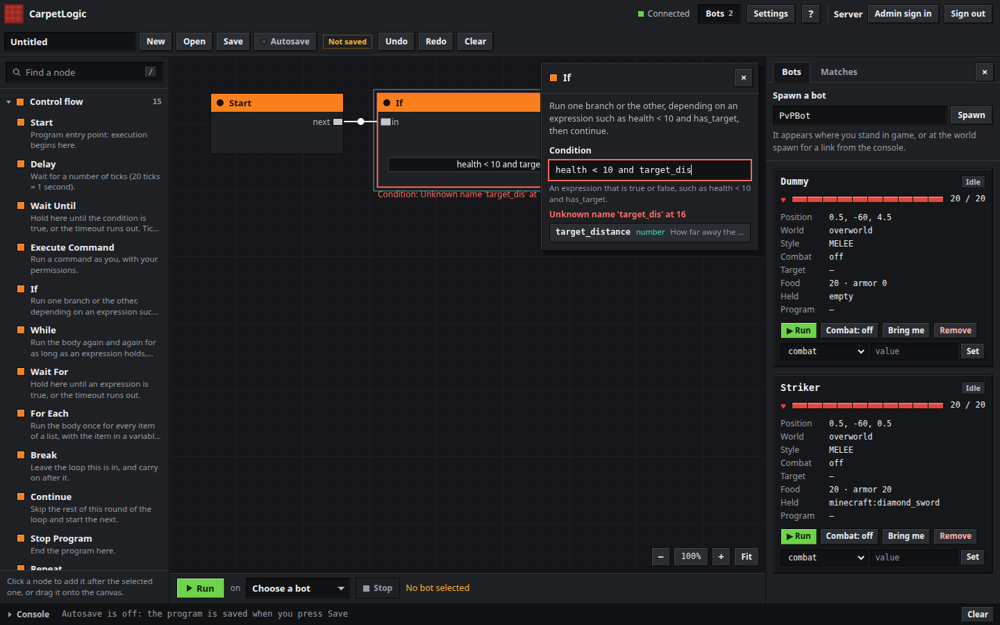

A program with a mistake in a field is saved as a draft with that mistake as the reason, and Run
refuses it. The server checks again: `POST /api/execute` answers `400` with
`MOVE.ticks: Unknown name 'helth' at 0`. What can only go wrong while it runs, such as a variable that
holds text where a number is needed, stops the program with the step and the parameter named:
`DELAY.ticks: Expected a number but got text`.

**Limits.** An expression has at most 1024 characters, 256 parts and 32 levels of nesting; a list at
most 256 items, counting the lists inside it and everything in them, and a text 1024 characters. Working one out is paid for from the same 1000 steps a tick
that the nodes are, one step a part plus the function's steps, so `While entities('zombie', 8) == 0`
runs some forty times a tick and is then put off to the next, like any loop.

## Waiting

Most actions with a `ticks` parameter hold the program for that many ticks before the next action
starts. `ticks` of 0 means no wait at all — the action's cleanup, if it has one, runs immediately.

| Wait | How it ends |
|---|---|
| `Control/Delay` | after `ticks` ticks |
| `ticks` on a step | after that many ticks, then the step's own cleanup (stop attacking, stop using, …) |
| `Navigation/NavGoto` | when navigation stops. It takes no `ticks` parameter |
| `Navigation/FollowPlayer`, `ChasePlayer`, `Patrol` | when navigation stops, or when `ticks` runs out |
| `Navigation/Wander` | when `ticks` runs out, picking a new destination whenever it runs out of road |
| `Navigation/FleeFrom` | when the bot is clear of the danger, retested every 10 ticks, or when `ticks` runs out |
| `Elytra/GlideGoto` | when gliding stops or the goal is within `radius` |
| `Control/WaitUntil` | when its condition holds, or after `timeout` ticks |
| `Combat/Fight` | when the target or the bot is gone, when the target stays out of `range` for `rangeTicks`, or after `timeout` ticks |

An event handler that interrupts the main sequence puts back the wait it interrupted, so the main
sequence resumes exactly where it was.

## Who drives the bot

A program drives the bot's action pack directly. The combat AI drives the very same pack when it is on.
Two drivers on one body means the program has to stand back for as long as the AI is fighting:

> While a combat node is active, the brain owns the body. The program does not issue movement or click
> actions of its own, and when the node ends the program gets the body back with the inputs released.

What that means in practice:

- `COMBAT_START` and `FIGHT` release what the program was holding down — its clicks, its shield, its
  navigation — before the AI's first tick. From then on the AI has the body to itself.
- While at least one combat node is open, the steps that drive the body are **skipped**, not queued and not
  waited out: `MOVE`, `STRAFE`, `SPRINT`, `SNEAK`, `JUMP`, `MOUNT`, `DISMOUNT`, `STOP_MOVEMENT`, `ATTACK`,
  `ATTACK_CRIT`, `SWORD_BLOCK`, `SHIELD_BLOCK`, `USE`, `PLACE_BLOCK`, `PLACE_CRYSTAL`,
  `DETONATE_CRYSTAL`, every navigation node and every elytra node. Those are the steps the schema marks
  `drivesBody`. A skipped step is not even asked for its carpet rule, so a fight is never stopped by a
  navigation node that the fight itself made redundant. The program is told once per run, in the log and
  the editor:

  ```
  Program 'My duel' on Bot1 wanted to MOVE while a combat node owned Bot1, so it was skipped. The brain drives the body until the node ends.
  ```

- Everything else still runs: waiting, variables, equipment, looking, event handlers, `IF_THEN_ELSE`, and
  the combat nodes themselves. A `WAIT_UNTIL` on a combat condition between `COMBAT_START` and
  `COMBAT_STOP` is the ordinary way to end a fight on a health threshold rather than a timeout.
- `COMBAT_STOP`, or a fight node reaching its end, gives the body back with the inputs released: nothing
  is held down, navigation is off, and the AI has let go of what its style was doing. A `COMBAT_STOP`
  with no combat node open turns the AI off anyway, so a program can switch off a bot that `/bot spawn`
  started fighting with.
- Nested combat nodes count. A fight node inside an event handler may open and close its own fight while
  the sequence's `COMBAT_START` is still open; the AI stops when the last one closes.
- A program that ends, fails or is stopped while its bot is fighting leaves the bot **not** fighting, with
  the inputs released. A program that never turned the AI on leaves it exactly as it found it — a bot
  spawned with `/bot spawn` keeps fighting after an unrelated program ends.
- Turning the AI on or off is not a carpet rule and needs no permission beyond running programs. What the
  AI does with the bot afterwards is the bot's own business, the same as `/bot option combat true`.

## Events

`Events/OnEvent` registers a reaction. It is reached once, registers itself, and the sequence
carries on. From then on:

- The event is watched every tick. It fires on its **rising edge only**: the condition has to go
  from false to true.
- When it fires, the handler's children take over from the main sequence. Whatever the main
  sequence was waiting for is put back when they finish, and the main sequence continues from there.
- An event that fires again while its own handler is still running is ignored.
- Whether the event already held when the handler was registered is remembered at that point, so a
  handler never fires immediately on the spot.
- A handler with no children is registered but never runs.

| Event | Fires when | Parameters |
|---|---|---|
| `when_hit` | the bot's health went down since the last tick | none |
| `when_health_below` | health is below `value` | `value` |
| `when_target_lost` | the player in `target` is gone, or in another dimension | `target` |
| `when_target_in_range` | the player in `target` is within `value` blocks | `target`, `value` |
| `when_kill` | the entity the bot was fighting died | none |
| `when_totem_pop` | a totem of undying saved the bot's own life | none |
| `when_target_acquired` | the combat AI picked a target it did not have | none |

The first four are watched every tick and fire on their rising edge. The last three are told once by the
game or by the AI and are seen once each:

- `when_kill` and `when_totem_pop` come from the game itself: the hook that reports a death is where the
  game decides to call `die`, and the one that reports a totem is where it spends the totem. Nothing is
  watched or polled for either, so a program sees each of them exactly once and never sees a stale one.
- `when_target_acquired` is the AI's own decision — nothing in the game reports it — so it is the edge of
  the bot having a target: it fires when it gets one, not while it keeps it.

`when_hit` needs health tracking, which is only kept while a program has at least one handler.

### A worked example

A bot that fights five rounds, counting them in a variable, blocking and backing off whenever it
drops below half health. The program an editor sends looks like this — you would not normally write
it by hand:

```json
[
  { "type": "EQUIP_ARMOR", "params": { "armorSet": "diamond" } },
  { "type": "SET_VARIABLE", "params": { "name": "rounds", "value": 0 } },

  { "type": "ON_EVENT",
    "params": { "event": "when_health_below", "value": 8 },
    "children": [
      { "type": "STOP_MOVEMENT" },
      { "type": "SWORD_BLOCK", "params": { "ticks": 30 } },
      { "type": "MOVE", "params": { "direction": "backward", "ticks": 20 } }
    ] },

  { "type": "LOOK_AT_PLAYER", "params": { "player": "" } },

  { "type": "LOOP",
    "params": { "count": 5 },
    "children": [
      { "type": "SPRINT", "params": { "enabled": true } },
      { "type": "MOVE", "params": { "direction": "forward", "ticks": 3 } },
      { "type": "ATTACK_CRIT", "params": { "ticks": 10 } },
      { "type": "ADD_VARIABLE", "params": { "name": "rounds", "amount": 1 } },
      { "type": "WAIT_UNTIL",
        "params": { "timeout": 40 },
        "condition": { "type": "CONDITION_HEALTH",
                       "params": { "operator": "<", "value": 20 } } }
    ] },

  { "type": "STOP_MOVEMENT" }
]
```

What happens, tick by tick:

1. `EQUIP_ARMOR` puts diamond armour on, instantly, and moves on — it has no `ticks`.
2. `$rounds` is set to 0. It is never read again in this program; it is here to show the syntax.
3. The `ON_EVENT` node registers a `when_health_below 8` handler and carries on. From this moment
   the executor remembers the bot is at full health, so dropping below 8 fires once, and only once
   per fall.
4. `LOOK_AT_PLAYER` with an empty name turns the bot towards the nearest real player.
5. The `LOOP` runs its children five times. `SPRINT` turns sprinting on without waiting. `MOVE
   forward 3` starts walking for three ticks, then stops on its own. `ATTACK_CRIT ticks=10` jumps,
   waits for the fall, hits, and stops. `ADD_VARIABLE` bumps `$rounds` without waiting.
   `WAIT_UNTIL` pauses the loop until the bot has been hit at all (health under 20) or 40 ticks pass,
   whichever comes first — so a round cannot outrun the opponent.
6. `STOP_MOVEMENT` finishes the program, which then reports `COMPLETED`.

At any point in the loop, if the bot drops below 8 health the handler jumps in: it stops dead,
raises the sword for 30 ticks (`SWORD_BLOCK`, which needs `swordBlockHitting`), then walks backwards
for 20 ticks. The loop picks up where it was afterwards, still mid-round.

The same program as saved by the editor also carries a `graphData` field with the node graph, so
reopening it in the editor shows the picture rather than a list.

### The built-in presets

Ten programs ship in the mod jar. They appear in the editor's preset list and can be run with
`/carpetlogic programs run <name> <bot>`, which looks a name up in the saved programs first and in
the presets second, ignoring case; `/carpetlogic programs` on its own lists the saved ones only.
Presets cannot be overwritten.

| Id | Name | What it does |
|---|---|---|
| `preset_wtap` | W-Tap | Sprint, three ticks forward, attack, release sprint, two ticks, re-sprint, six ticks — forever |
| `preset_blockhit` | Block Hit | Attack, four ticks of sword block, two ticks — forever. Needs `swordBlockHitting`. |
| `preset_critchain` | Crit Chain | Sprint, a crit attack every ten ticks, twelve ticks apart |
| `preset_circlestrafe` | Circle Strafe | Strafe left, attack, forward, attack, strafe right, attack, forward |
| `preset_shieldbreak` | Shield Break | Switch to slot 2 and hit to break the shield, switch back to slot 1 and hit three times |
| `preset_dummy` | Target Dummy | Equip diamond armour and stand still facing north |
| `preset_combo` | Combo Practice | W-tap, strafe and crit attacks, then a sword block, combined |
| `preset_patrol_fight` | Patrol and Fight | Take the sword kit, walk a patrol forever, and fight whatever hits the bot, then carry on patrolling |
| `preset_duel_rekit` | Duel then Re-Kit | Fight the nearest bot until the duel is over, take a fresh kit, wait, and do it again |
| `preset_retreat_low` | Retreat when Low | Fight; below six health break off, run 24 blocks away, eat, and go back in |

The last three use the combat nodes, and are worth reading as examples: a `FIGHT` inside an event handler
(`Patrol and Fight`), a `FIGHT` and a `GIVE_KIT` in a loop (`Duel then Re-Kit`), and a `COMBAT_START`, a
`WAIT_UNTIL` on `Conditions/Health`, a `COMBAT_STOP` and then the program's own movement (`Retreat when
Low`).

## The per-tick budget

A program runs until it reaches an action that takes time, and resumes on a later tick. Without a
limit, a loop with nothing to wait for would never give the tick back, so the executor runs **at
most 1000 steps per program per tick**.

When a program hits that limit it is paused until the next tick and the web editor is sent one
warning, once per program:

```
Program 'W-Tap' on Bot1 ran 1000 steps in one tick and was paused until the next. Put a Delay inside its loop.
```

The fix is always the same: give the loop a `Control/Delay`, or a `ticks` on one of its steps. The
self-test scenario `logic_forever_budget` covers exactly this case.

The combat nodes have scenarios of their own, all of them on a real bot rather than a stub:
`logic_combat_start_stop`, `logic_fight_node`, `logic_combat_option`, `logic_on_kill_event`,
`logic_totem_pop_event` and `logic_stop_program_stops_fight`.

`logic_save_draft_and_autosave` covers saving over HTTP against the running server: a draft is written
to a file named after it with its graph and the reason, comes back the same after the folder is read
again, and is refused by `programs run`; saving it again writes nothing; a save from an older copy is
refused; the version that compiles is saved over it under a new name, its file is renamed, and it
runs.

`logic_admin_login` covers the admin sign-in over HTTP against the running server: an operator sets
a password through the console's link, signs in and changes a rule, and a second use of the link, a
wrong password, a token from `/carpetlogic open`, a value the rule refuses and the operator once
deopped are all refused, as are the routes while the rule is off.

## The HTTP API

For scripting the editor rather than clicking in it. Everything here runs on the server thread, on
behalf of the session the token belongs to.

```
Authorization: Bearer <token>
Content-Type: application/json
```

A missing, unknown or expired token gets `401` and a `WWW-Authenticate: Bearer` header. A token
whose owner is offline, or no longer allowed to use `/carpetlogic`, gets `403`. A non-`GET` under
`carpetLogicViewerMode` gets `403`. A body over 2 MiB gets `413`. A request the server thread does
not answer within 5 seconds gets `503`.

Errors are always `{"error": "..."}`. While `carpetLogicAdminLogin` is on a `401` also carries
`"adminLogin": true`, which is how a page without a token learns that it can offer the sign-in.

Two routes take no token, `POST /api/login` and `POST /api/password`, and only while
`carpetLogicAdminLogin` is on. With the rule off they are answered like any other path: `401` without
a token, `404 Unknown API endpoint` with one.

### `GET /api/status`

Who the token belongs to, and what the server is doing.

Response:

```json
{
  "version": "18",
  "user": "Steve",
  "viewerMode": false,
  "admin": false,
  "adminLogin": false,
  "activeBots": 2,
  "runningPrograms": 1,
  "savedPrograms": 7,
  "maxPrograms": 4,
  "programsFolder": "world/carpetlogic/programs"
}
```

`admin` says whether the token came from the admin sign-in, `adminLogin` whether the server offers
one.

### `GET /api/settings`

The rules CarpetLogic and the actions depend on, so the editor can grey out what is off, plus the lists the
combat nodes need and the schema cannot know.

Response keys: `commandCarpetLogic`, `carpetLogicPort`, `carpetLogicBindAddress`,
`carpetLogicSessionHours`, `carpetLogicUpdateInterval`, `carpetLogicMaxPrograms`,
`carpetLogicViewerMode`, `fakePlayerNavigation`, `fakePlayerElytraGlide`, `swordBlockHitting`,
`combatStyles`, `difficulties`, `kits`, `combatOptions`, `rules`, and `locked` when the settings are
locked.

| Key | What it holds |
|---|---|
| `combatStyles` | every combat style `/bot spawn` takes, `sword` for the melee style |
| `difficulties` | `beginner`, `casual`, `average`, `skilled`, `expert` |
| `kits` | every kit this server can give out: the six built-in ones and whatever is in the world's `carpet-kits` folder |
| `combatOptions` | every setting name `/bot option` and `/player <name> ai` accept, the per-style options included |

The style and difficulty lists are the same ones the schema carries in the resolved `options` of those
parameters, generated from the bot's enums; the kits cannot be in the schema at all, because they depend on
the world's folder.

`rules` is what the Settings panel draws: every rule it shows, from the rule registry, in the panel's
order.

```json
{
  "name": "carpetLogicMaxPrograms",
  "group": "editor",
  "type": "int",
  "value": "4",
  "default": "4",
  "strict": false,
  "description": "Maximum number of bot programs running at the same time",
  "options": [],
  "extra": []
}
```

`group` is `editor` for the `carpetLogic*` rules and `commandCarpetLogic`, `actions` for a rule an
action of the schema `requires`, and `bots` for the rules of the `pvp` category, the bots' defaults.
`type` is `boolean`, `int`, `number` or `string`; `value` and `default` are spelled as `/carpet`
spells them. `strict` means only one of `options` is taken; otherwise they are suggestions. `locked`,
when present, is the reason no rule can be changed while the server runs.

### `POST /api/settings`

Change one of those rules. Only for a token from the admin sign-in, and only while
`carpetLogicAdminLogin` is on; with the rule off the route is `404 Unknown API endpoint`.

Request body: `{"rule": "carpetLogicMaxPrograms", "value": "8"}`. The value is text, as `/carpet` takes
it.

Response: `{"success": true, "rule": { ... }}` with the rule as it now is, and `"message"` when the
rule had something to say.

| Status | When |
|---|---|
| `400` | `rule` or `value` is missing, or the rule refused the value: the error is the validator's reason, and `rule` carries the value it still has |
| `403` | the token is not an admin's, or its account may no longer change Carpet rules |
| `404` | the editor has no setting of that name |
| `409` | the settings are locked in `carpet.conf` |

This is the one non-`GET` an admin's token may still send under `carpetLogicViewerMode`.

### `POST /api/login`

Sign an admin in. No token; `Content-Type: application/json`; at most 4 KiB.

Request body: `{"name": "Steve", "password": "..."}`

Response: `{"token": "...", "user": "Steve", "admin": true}`

| Status | When |
|---|---|
| `400` | the body is not a name of 1 to 32 characters without spaces and a password of 1 to 128 |
| `401` | `Wrong name or password`, for every reason a sign-in can fail |
| `415` | the content type is not `application/json` |
| `429` | too many attempts for the name or from the address; `Retry-After` and `"retryAfter"` give the seconds to wait |
| `503` | too many sign-ins are being checked at once |

### `POST /api/password`

Set an admin's password with the ticket of a link from `/carpetlogic password`. No token;
`Content-Type: application/json`; at most 4 KiB.

Request body: `{"ticket": "...", "name": "Steve", "password": "..."}`

Response: `{"success": true, "name": "Steve"}`. The ticket is used up, and the account's admin sessions
are ended.

| Status | When |
|---|---|
| `400` | a field is missing, or the password has fewer than 10 or more than 128 characters; the ticket can be used again |
| `403` | `This link is no longer valid`: the ticket is unknown, used, older than 10 minutes, for another name, or its account is no longer an admin |
| `429` | too many bad tickets from the address |

### `POST /api/logout`

End the session of the token the request carries. No body. Works under viewer mode and for a token
whose player has left.

Response: `{"success": true}`. Any event stream the session had open is closed.

### `GET /api/schema`

The whole of `carpetlogic/actions.json`, verbatim except that each `optionsFrom` is replaced in place by
the `options` array it resolves to. This is what the editor compiles against.

### `GET /api/programs`

An array of the saved programs, as stored, each with three more fields: `folder` (the subfolder, or
empty), `file` (where it is kept, relative to the server's directory) and `draft`. The folder is read
again for every call. Does not include the presets.

### `GET /api/presets`

An array of the built-in presets.

### `POST /api/programs`

Save a program.

Request body: a program object — `id`, `name`, `description`, `actions`, `graphData` — and
optionally `error`, `folder`, `baseUpdatedAt` and `force`.

```json
{
  "id": "myrounds",
  "name": "My rounds",
  "description": "five crits",
  "actions": [ { "type": "MOVE", "params": { "direction": "forward", "ticks": 20 } } ],
  "baseUpdatedAt": 1730000000000
}
```

An empty or missing `id` gets one generated. Saving over an existing id keeps that program's
`createdAt` and its folder. A program cannot take a preset's id.

- `error` makes it a draft: the reason is kept and the actions are not. Actions that do not fit the
  schema make it a draft too, with the schema's complaint as the reason, instead of a refusal.
- `folder` puts a new program into a subfolder.
- `baseUpdatedAt` is the `updatedAt` of the copy the save started from. When the stored copy has
  another one the save is refused with `409`; `force: true` saves over it. Without `baseUpdatedAt`
  nothing is checked.

Response:

```json
{
  "success": true,
  "id": "myrounds",
  "name": "My rounds",
  "folder": "",
  "file": "world/carpetlogic/programs/My-rounds.json",
  "updatedAt": 1730000005000,
  "draft": false,
  "unchanged": false
}
```

`name` is the name the server settled on, which differs from the one sent when that was taken or
empty. `draft` comes with `reason`. `unchanged` is true when the program was already stored exactly so,
and then nothing was written and `updatedAt` is the old one.

| Status | When |
|---|---|
| `400` | the id is not a valid one or is a preset's |
| `409` | `{"error": "...", "conflict": true, "updatedAt": ...}`: the stored copy is not the one this save started from |
| `429` | more than 60 writes in a minute from this session |
| `500` | the file could not be written; the error says where and why |

### `POST /api/programs/move`

Put a program into a subfolder of the programs folder, or back. Request body
`{"id": "myrounds", "folder": "Drills"}`; an empty `folder` is the programs folder itself. The folder
name is made safe the way a file name is, at most 32 characters, and is created when it is not there;
a subfolder that has lost its last program is removed.

Response `{"success": true, "folder": "Drills", "file": "world/carpetlogic/programs/Drills/My-rounds.json"}`.
`404` when there is no such program.

### `DELETE /api/programs/<id>`

Delete a program. `<id>` is the part after `/api/programs/`.

Response: `{"success": true}` or `{"success": false}` when there is no such program.

`400` for an id that is not 1–64 characters of letters, digits, `_` and `-`.

### `GET /api/bots`

The whole panel state in one object:

```json
{
  "bots": { "Bot1": { ... } },
  "programs": { "Bot1": { "programName": "...", "status": "RUNNING", "currentAction": "MOVE", "error": null, "running": true } },
  "combatSettings": [ "combat", "autotarget", "..." ],
  "viewerMode": false
}
```

`bots` is keyed by bot name. Each value is the bot's state: `name`, `x`, `y`, `z`, `yaw`, `pitch`,
`health`, `maxHealth`, `absorption`, `armor`, `alive`, `foodLevel`, `gamemode`, `dimension`,
`sprinting`, `sneaking`, a nested `equipment` object with one field per slot (`mainhand`, `offhand`,
`head`, `chest`, `legs`, `feet`, `body`, `saddle`) holding the item id or `"empty"`, a `pvp` object
with `combat` and `style`, and `target` and `program`, both null for a bot that is not doing either.

`combatSettings` is every setting name `/bot option` takes, which is what the editor's per-bot combat
dropdown is built from.

### `GET /api/matches`

An array of the last fifty finished fights, newest first. Each entry is `attacker`, `defender`,
`winner`, `ticks`, `attackerDamage` and `defenderDamage`. Nothing is written here when nobody was
watching, so a `/bot match` stopped early records nothing.

### `POST /api/bots/config`

Change one setting on one bot. Request body `{"name": "Bot1", "key": "difficulty", "value": "expert"}`.
`key` and `value` must both be given, non-empty and at most 64 characters, with control characters
stripped. The value is applied exactly as `/bot option` applies it, and the faction registry is kept
in step.

Response `{"success": true, "pvp": {"combat": true, "style": "MELEE"}}`.

`404` when there is no such bot, `400` for a malformed body or for a value the bot refuses, with the
reason.

### `POST /api/bots/tp`

Bring a bot to the owner of the token. Request body `{"name": "Bot1"}`. Response `{"success": true}`.

`400 Only a link opened in game can bring a bot to its owner` for a token that has no player behind
it, `404` for no such bot.

### `POST /api/bots/spawn`

Spawn a bot. Request body:

```json
{ "name": "Bot1", "x": 100.5, "y": 64, "z": -20.5 }
```

`name` is 1–16 letters, digits or underscores. Without `x`, `y` and `z` the bot spawns where the
token's owner is; a console token spawns it at the world spawn point. The dimension is the owner's
dimension, or the overworld for a console token. The game mode is survival.

Response: `{"success": true, "name": "Bot1", "pending": true}` — the bot joins a moment later,
once its profile has been resolved.

`400` when the name is already online, still logging in, outside the world, or is a name that does
not exist on an online-mode server.

### `POST /api/bots/remove`

Take a bot out. Request body: `{"name": "Bot1"}`. Any program running on it is stopped first.

Response: `{"success": true}`. This disconnects the bot rather than killing it: a bot that dies in the
world comes back on the next tick, which is not what an editor's "remove" should do.

### `POST /api/execute`

Run a program from the action tree in the request, without saving it first.

Request body:

```json
{
  "name": "untitled",
  "botName": "Bot1",
  "actions": [ { "type": "MOVE", "params": { "direction": "forward", "ticks": 20 } } ]
}
```

Programs always run from the actions sent here, never by id, because the commands inside them run
as the token's player.

Response: `{"success": true}`

| Status | When |
|---|---|
| `400` | `actions` is missing or not an array, or the actions do not fit the schema |
| `409` | refused: no such bot, or `carpetLogicMaxPrograms` programs are already running |

### `POST /api/stop`

Stop whatever is running on a bot. Request body: `{"botName": "Bot1"}`.

Response: `{"success": true}` or `{"success": false}` when nothing was running.

### `GET /api/events`

A Server-Sent Events stream. This one has no `/api/` prefix in its path handling — it is matched
before the body is read, so send no body.

The first message is a full snapshot:

```
data: {"bots":{...},"programs":{"Bot1":{"programName":"...","status":"RUNNING","currentAction":"MOVE","error":null,"running":true}},"combatSettings":["..."],"viewerMode":false,"type":"botUpdate"}

```

Then, every `carpetLogicUpdateInterval` ticks, another `botUpdate` with the same shape. Whenever a new
fight has been recorded, a `matchUpdate` goes out as well:

```
data: {"type":"matchUpdate","matches":[{"attacker":"Bot1","defender":"Steve","winner":"Bot1","ticks":300,"attackerDamage":45.5,"defenderDamage":12.0}]}

```

Program log lines arrive as:

```
data: {"type":"log","level":"WARN","message":"...","timestamp":1730000000000}

```

Levels are `INFO`, `WARN` and `ERROR`. An idle connection gets `: keep-alive` every 15 seconds, so
proxies do not drop it. The stream closes when the token expires, when the owner goes offline or
loses permission, when the server shuts down, or when the client disconnects.

`503` with "Too many editors are connected" past 16 open streams.
## What the server does not do

Worth knowing when something does not happen:

- Only `GET` is served for the editor's own files. Any other method on one of them is `405 Method
  not allowed`; a path with an extension outside `html css js json txt png svg`, or a path containing
  `..`, is `404 Not found`; `/` is `/index.html`. The responses carry `X-Content-Type-Options:
  nosniff`, `Cache-Control: no-cache`, `Referrer-Policy: no-referrer` and a strict
  `Content-Security-Policy`.
- An unmapped method and path is `404 Unknown API endpoint`. A request that throws is `500 Internal
  error`, and one that is interrupted by the server shutting down is `503 The server is shutting
  down`.
- While no event stream is open, the tick loop gathers nothing for the editor at all.
- A program name sent to `POST /api/programs` or `POST /api/execute` has its control characters turned
  into spaces, is stripped, becomes `Untitled` when nothing is left and is cut at 64 characters.
  `POST /api/execute` builds an unsaved program with the id `_unsaved`.
- A server-thread interrupt closes every open event stream, and closing the server stops everything
  the editor was running.

## Related pages

- [Bots.md](Bots.md) — the combat AI a combat node takes over
- [Practice.md](Practice.md) — the match list this page's `GET /api/matches` serves
- [Menus.md](Menus.md) — the in-game menu, which is a different way in
- [Kits.md](Kits.md) — the `kits` list a `GIVE_KIT` node draws on
- [FakePlayers.md](FakePlayers.md) — `/player` in full
- [Rules.md](Rules.md) — the `carpetLogic*` rules and their defaults
- [Commands.md](Commands.md) — every command
- [SelfTest.md](SelfTest.md) — the `logic_*` scenarios that cover this
